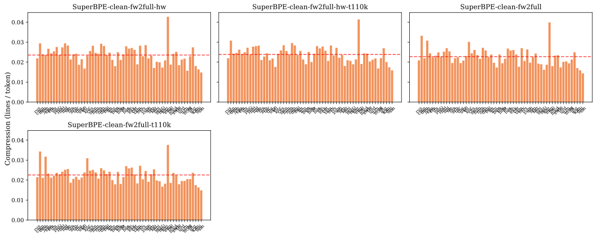

# Tokenizer comparison for Apertus

Purpose: choose a tokenizer for Apertus. The decision axes are (i) distributional quality (enabling better downstream language modeling); (ii) **multilingual efficiency & fairness**; (iii) **production safety** (it must not silently corrupt text or emit unknown tokens). This is my recommendation and the evidence it's based off of.

**How to read:** ↑ = higher is better, ↓ = lower is better. Sanity verdicts are **pass** (no issue) / **warn** (advisory, not disqualifying) / **fail** (disqualifying defect) / **n/a** (check doesn't apply, neutral). All evaluated tokenizers are GPT-2-style **byte-level** (so a 'byte coverage' or 'byte encoding' column would be constant and is omitted). Metric definitions, datasets, and the design matrix are in *Methods and metrics*; exhaustive tables in the appendix.

Disclaimer: Claude helped compile this report from all of my analyses. All numbers are computed and inserted programmatically, but if something seems off, please flag it.

## Contents

- [Recommendation](#recommendation)
- [Metric guide](#metric-guide)
- [Candidate comparison](#candidate-comparison)
  - [Candidates and references across FLORES sets](#candidates-and-references-across-flores-sets)
- [Trade-offs](#trade-offs)
- [Missing evidence](#missing-evidence)
- [Design-choice ablations](#design-choice-ablations)
  - [Punctuation/whitespace capping (capped vs uncapped)](#punctuationwhitespace-capping-capped-vs-uncapped)
  - [Parity-aware vs plain BPE](#parity-aware-vs-plain-bpe)
  - [SuperBPE on the PA-BPE candidate base (does SuperBPE help, matched data)](#superbpe-on-the-pa-bpe-candidate-base-does-superbpe-help-matched-data)
  - [Pretokenizer family (apertus vs clean-multi vs gpt4)](#pretokenizer-family-apertus-vs-clean-multi-vs-gpt4)
  - [Hybrid-window vs base parity](#hybrid-window-vs-base-parity)
  - [SuperBPE transition point & vocab size (t90k/128k vs t110k/130k, clean fw2full)](#superbpe-transition-point--vocab-size-t90k128k-vs-t110k130k-clean-fw2full)
- [Production-safety gates](#production-safety-gates)
- [Round-trip fidelity — where reconstruction differs](#round-trip-fidelity--where-reconstruction-differs)
- [Vocabulary usage — Active / Rare / Uncommon / Unseen, and Scaffold](#vocabulary-usage--active--rare--uncommon--unseen-and-scaffold)
- [Methods and metrics](#methods-and-metrics)
  - [Metrics legend](#metrics-legend)
  - [Tokenizer design matrix](#tokenizer-design-matrix)
- [Appendix — full intrinsic tables (all FLORES sets)](#appendix--full-intrinsic-tables-all-flores-sets)
  - [broad — multilingual set across resource levels (FLORES dev split, 997 sent/lang) (60 languages, 59820 parallel sentences/tokenizer)](#broad--multilingual-set-across-resource-levels-flores-dev-split-997-sentlang-60-languages-59820-parallel-sentencestokenizer)
  - [core — high-resource core (FLORES dev split, 997 sent/lang) (13 languages, 12961 parallel sentences/tokenizer)](#core--high-resource-core-flores-dev-split-997-sentlang-13-languages-12961-parallel-sentencestokenizer)
  - [full — all available FLORES+ languages (devtest split, 1012 sent/lang) (205 languages, 207459 parallel sentences/tokenizer)](#full--all-available-flores-languages-devtest-split-1012-sentlang-205-languages-207459-parallel-sentencestokenizer)
- [Appendix — additional ablations](#appendix--additional-ablations)
  - [PA-BPE training-data config (gpt4: balanced vs FineWeb2-full)](#pa-bpe-training-data-config-gpt4-balanced-vs-fineweb2-full)
  - [Parity tuning — European-family up-weighting (original ×1.0 → ×1.1 → ×1.2)](#parity-tuning--european-family-up-weighting-original-10--11--12)
  - [Tuned config — semitic regroup of script-mismatched languages (with vs without)](#tuned-config--semitic-regroup-of-script-mismatched-languages-with-vs-without)
  - [SuperBPE base, transition point & stage-2 preset](#superbpe-base-transition-point--stage-2-preset)
  - [SuperBPE training data (balanced vs FineWeb2-full)](#superbpe-training-data-balanced-vs-fineweb2-full)
  - [Hybrid-window vs base parity, under SuperBPE](#hybrid-window-vs-base-parity-under-superbpe)
  - [Algorithm / pretok (plain BPE vs Unigram, right-align digits, gpt2-style)](#algorithm--pretok-plain-bpe-vs-unigram-right-align-digits-gpt2-style)
  - [SuperBPE vs. its PA-BPE base — what the superword stage changes](#superbpe-vs-its-pa-bpe-base--what-the-superword-stage-changes)
- [Appendix — extrinsic (downstream LM) details](#appendix--extrinsic-downstream-lm-details)
- [Appendix — per-language plots (compression & vocabulary utilization)](#appendix--per-language-plots-compression--vocabulary-utilization)
- [Appendix — long-token (>64 char) examples](#appendix--long-token-64-char-examples)
  - [Junk-token examples](#junk-token-examples)
  - [Dead / unreachable vocabulary examples (tokens that can never be emitted)](#dead--unreachable-vocabulary-examples-tokens-that-can-never-be-emitted)

## Recommendation

I recommend PA-Clean-capped as the default. Against the current Apertus tokenizer it is fairer across languages (Gini, the inequality of per-language encoding cost, 0.081 against 0.205; lower is fairer) and encodes the multilingual text more compactly (about 0.023 against 0.0198 FLORES sentences per token), and it matches Apertus on downstream modeling quality over the training languages (FLORES bits-per-byte, trained languages, 1.169 against 1.168). It has the highest candidate math score (MC-math 0.295) and the highest candidate Python code-generation score (MBPP pass-rate 0.190); its clean-multi pretokenizer keeps math operators as separate tokens (operator-isolation 0.99).
PA-Apertus-capped is the better fit where multilingual modeling matters more than code. It has the same fairness (Gini 0.081), but its pretokenizer merges operators with operands (operator-isolation 0.50), which lowers code generation (MBPP 0.058, below the clean-multi candidates at p_BH<0.001).
SuperBPE-clean-cap-hw encodes English most compactly (5.01 bytes per token, against 4.24 for PA-Clean-capped) but is less fair (Gini 0.106). I'd treat it as provisional until its bits-per-byte are measured.
For some use cases, the cost is a little English compression: the parity-aware candidates encode English at 4.24–4.34 bytes per token, against Apertus's 4.60. Apertus's own math and code scores are still running.
Disqualified by a production-safety fail: Gemma 3 (see *Production-safety gates*).

## Metric guide

Full definitions in *Methods and metrics*.
- **sent/tok** — FLORES sentences (lines) per token; higher = more multilingual compression.
- **Gini** — cross-language inequality of per-language token cost; lower = more equal.
- **vocab-util CoV** — cross-language variation in vocabulary use; lower = more even.
- **Eng B/tok** — FineWeb-Edu English bytes per token; higher = more compression.
- **Val BPB / FLORES BPB** — downstream LM bits per byte; lower = better. The headline FLORES BPB is the macro-mean over the 31 training languages; the full 214-language macro is in the appendix.
- **MC-math / MBPP** — downstream math and code scores; higher = better.
- **gate** — production-safety verdict (pass/warn/fail); fail disqualifies.

## Candidate comparison

The recommended tokenizers and the current Apertus production baseline, on the decision metrics. The intrinsic columns are computed on the broad FLORES set. Val BPB, FLORES BPB, MC-math, and MBPP come from the downstream language models. FLORES BPB here is the macro-mean over the 31 FLORES languages in the LM training set; the full 214-language macro is in the appendix. The Apertus baseline's math+code run is in progress, so its MC-math and MBPP are `pending`. `pending` means the run is mapped but not yet measured, and `—` means not run.

| Tokenizer | Role | Multiling. sent/tok ↑ | Gini ↓ | Vocab-util CoV ↓ | Eng B/tok ↑ | Vocab util ↑ | Val BPB ↓ | FLORES BPB (trained) ↓ | MC-math ↑ | MBPP ↑ [95% CI] | Gate |
|---|---|---|---|---|---|---|---|---|---|---|---|
| PA-Clean-capped | default | 0.0232 | 0.081 | 0.4138 | 4.24 | 0.605 | 0.729 | 1.169 | 0.295 | 0.190 [0.158, 0.224] | warn |
| PA-Apertus-capped | conditional | 0.0233 | 0.081 | 0.4130 | 4.34 | 0.606 | 0.729 | 1.170 | 0.270 | 0.058 [0.038, 0.080] | warn |
| SuperBPE·clean-cap·hw·fw2full·t90k/128k | provisional | 0.0227 | 0.106 | 0.4892 | 5.01 | 0.550 | 0.732 | 1.161 | 0.268 | 0.196 [0.162, 0.232] | warn |
| Apertus | baseline | 0.0198 | 0.205 | 0.5133 | 4.60 | 0.561 | 0.720 | 1.168 | pending | pending | warn |

`warn` is advisory: for NFC tokenizers exact-match below 1.0 is canonical re-spelling, not loss. MBPP has a paired-bootstrap 95% CI; MC-math is a single run.

### Candidates and references across FLORES sets

This table shows multilingual compression (sent/tok), fairness (Gini), and vocabulary utilization for every candidate and reference at all three FLORES sets (core, broad, full). The full intrinsic tables, with every column, are in the appendix.

| Tokenizer | sent/tok ↑ (core) | sent/tok ↑ (broad) | sent/tok ↑ (full) | Gini ↓ (core) | Gini ↓ (broad) | Gini ↓ (full) | Vocab util ↑ (core) | Vocab util ↑ (broad) | Vocab util ↑ (full) |
|---|---|---|---|---|---|---|---|---|---|
| PA-Apertus-capped | 0.0252 | 0.0233 | 0.0203 | 0.068 | 0.081 | 0.093 | 0.252 | 0.606 | 0.851 |
| PA-Clean-capped | 0.0251 | 0.0232 | 0.0201 | 0.067 | 0.081 | 0.098 | 0.252 | 0.605 | 0.853 |
| SuperBPE·apertus-cap·hw·fw2full | 0.0259 | 0.0230 | 0.0212 | 0.085 | 0.110 | 0.102 | 0.266 | 0.544 | 0.757 |
| SuperBPE·clean-cap·hw·fw2full·t90k/128k | 0.0255 | 0.0227 | 0.0208 | 0.080 | 0.106 | 0.103 | 0.266 | 0.550 | 0.776 |
| Apertus | 0.0275 | 0.0198 | 0.0142 | 0.071 | 0.205 | 0.313 | 0.344 | 0.561 | 0.648 |
| Gemma 3 | 0.0302 | 0.0244 | 0.0193 | 0.055 | 0.106 | 0.150 | 0.222 | 0.430 | 0.520 |
| GLM | 0.0225 | 0.0126 | 0.0116 | 0.206 | 0.379 | 0.354 | 0.251 | 0.347 | 0.405 |
| Kimi | 0.0217 | 0.0163 | 0.0144 | 0.153 | 0.199 | 0.213 | 0.173 | 0.225 | 0.275 |
| Qwen 3 | 0.0223 | 0.0136 | 0.0131 | 0.181 | 0.320 | 0.280 | 0.228 | 0.314 | 0.373 |
| Qwen 3.5 | 0.0295 | 0.0211 | 0.0160 | 0.099 | 0.180 | 0.242 | 0.234 | 0.379 | 0.445 |

## Trade-offs

- **Parity-aware vs plain BPE.** Parity-aware BPE has a lower Gini than plain BPE (0.081 against 0.114 at matched settings), at a small Eng B/tok cost (4.24 against 4.43). Use parity-aware BPE.
- **PA-BPE vs SuperBPE.** The SuperBPE stage raises Eng B/tok by 18–25%, but it also raises Gini (0.081 to 0.106) and lowers vocab utilization (0.605 to 0.550); on the apertus base it lowers MBPP (0.058 to 0.004). The added tokens are used mostly for space-delimited languages and rarely for CJK, Indic, or Thai.
- **clean-multi vs apertus.** clean-multi has a higher operator-isolation (0.99 against 0.50) and a higher MBPP (0.190 against 0.058). Use clean-multi unless multilingual FLORES BPB matters more than code generation.
- **Capped vs uncapped.** The capped regex produces fewer junk tokens (28 against 64) and has no dead-vocab warning, with no change to Eng B/tok or Val BPB. Keep capping enabled.
- **Hybrid-window vs base parity.** Hybrid-window has a higher Eng B/tok (4.24 against 3.13) with no fairness gain for base parity. Use hybrid-window.

## Missing evidence

- **Standard-budget BPB for the clean SuperBPE candidate is not yet measured**, for either the t90k/128k or the t110k/130k variant. The clean SuperBPE recommendation is provisional until these are measured. If its Val BPB and FLORES BPB are worse than the PA-BPE candidates, PA-Clean-capped remains the default.
- **Extrinsic coverage is partial.** The gpt4-pretok SuperBPE and PA-BPE variants and the right-aligned-digit variant have no trained model, and MultiBLiMP and MGSM are not run for every tokenizer. Those axes rest on the 1B proxy rather than a matched run.
- **Extrinsic numbers are single runs without seed variance.** MBPP is the exception (it has a paired-bootstrap CI). The MC-math difference between candidates (0.295 for PA-Clean-capped against 0.270 for PA-Apertus-capped) has no CI and is small.
- **The LMs are small proxies.** Whether the parity-aware BPE fairness difference or the SuperBPE Eng B/tok difference is larger at the target model scale is not measured here.
- **Vocabulary size is not swept.** Every candidate is near 128–131k, and size varies only alongside the SuperBPE transition rows, so it is confounded with the superword stage. A 64k/128k/256k sweep on one fixed design would separate the two.
- **NFC against no-NFC is not isolated** (the single noNFC tokenizer also differs in base and algorithm), and the references are not vocab-size-matched to the candidates, so the reference compression differences partly reflect vocabulary size. Newer algorithms are deferred because their code is not yet production-grade (see Methods).

## Design-choice ablations

Each ablation compares tokenizers that differ in one design choice, measured on the broad FLORES set. In each table, the columns most affected by that design choice are placed first, and a production-safety gate column is included only when its value differs across the tokenizers being compared. Where downstream-LM results exist, an *Extrinsic (downstream LM)* block follows the table. In that block, `[matched]` marks a tokenizer for which the report's own tokenizer was trained from scratch (Val, FLORES, and code BPB at 10B balanced; MC-math and MBPP at 20B math+code), and `[proxy]` marks a sibling tokenizer-lm run on a different tokenizer, which should be read as directional. `pending` means the run is mapped but the eval is not yet measured, and `—` means the eval was not run. The full per-tokenizer extrinsic table and the training setup are in the appendix.

### Punctuation/whitespace capping (capped vs uncapped)

This ablation compares capping runs of punctuation, symbols, and whitespace at 16 characters during pretokenization against leaving them uncapped.

Tokenizers using the capped regex produce 28 junk tokens, against 64 for the uncapped regex, and 8 long (>64 char) tokens against 14. The uncapped tokenizer also has one pretokenizer-unreachable vocab token, which the gate reports as a warning. Eng B/tok (4.24 against 4.24) and Val BPB (0.729 against 0.728) are unchanged; the uncapped tokenizer has a slightly lower Gini (0.074 against 0.081). Keep the capped regex.

| Tokenizer | Junk toks (≥8) ↓ | Long toks (>64) | Vocab util ↑ | Vocab size | Eng comp (B/tok) ↑ | Multiling. sent/tok ↑ | Vocab-util CoV ↓ | Gini ↓ | CER ↓ | Boundary-cross ↓ | Operator-isol ↑ | Dead vocab ↓ | Byte-frag (benign) |
|---|---|---|---|---|---|---|---|---|---|---|---|---|---|
| PA-Clean-capped | **28** | 8 | **0.605** | 127,835 | 4.238 | 0.0232 | 0.4138 | 0.081 | 0.00043 | 0.02198 | 0.987 | **0** | 5596 |
| PA-Clean-uncapped | 64 | 14 | 0.586 | 127,835 | **4.242** | 0.0232 | **0.3863** | **0.074** | 0.00043 | **0.02184** | 0.987 | 1 | 5691 |

*Faceted per-language vocabulary utilization, one pane per tokenizer:*

*Extrinsic (downstream LM):*
| Tokenizer | Val BPB ↓ | FLORES BPB ↓ | Code BPB ↓ | MC-math ↑ | MBPP ↑ [95% CI] |
|---|---|---|---|---|---|
| PA-Clean-capped [matched] | 0.729 | 2.965 | 0.533 | 0.295 | 0.190 [0.158, 0.224] |
| PA-Clean-uncapped [matched] | 0.728 | 2.966 | 0.529 | — | — |

### Parity-aware vs plain BPE

This ablation compares parity-aware BPE, which equalizes per-language encoding cost through its merge-selection rule, against plain frequency-driven BPE.

At matched capped settings, parity-aware BPE has a Gini of 0.081 against 0.114 for plain BPE, and a vocab-util CoV of 0.414 against 0.491. Multilingual compression is similar (sent/tok 0.0232 against 0.0228). Plain BPE has a higher Eng B/tok (4.43 against 4.24). On the 1B proxy, parity-aware BPE has a Val BPB 0.008 higher than plain BPE. Use parity-aware BPE for a multilingual tokenizer.

| Tokenizer | Gini ↓ | Vocab-util CoV ↓ | Multiling. sent/tok ↑ | Vocab size | Eng comp (B/tok) ↑ | Vocab util ↑ | CER ↓ | Boundary-cross ↓ | Operator-isol ↑ | Dead vocab ↓ | Byte-frag (benign) | Long toks (>64) | Junk toks (≥8) ↓ |
|---|---|---|---|---|---|---|---|---|---|---|---|---|---|
| PA-Clean-capped | **0.081** | **0.4138** | **0.0232** | 127,835 | 4.238 | 0.605 | 0.00043 | **0.02198** | **0.987** | **0** | 5596 | 8 | **28** |
| BPE-Clean-capped | 0.114 | 0.4913 | 0.0228 | 128,000 | 4.428 | **0.615** | 0.00043 | 0.02860 | **0.987** | **0** | 2642 | 0 | 46 |
| BPE-Clean-uncapped | 0.375 | 0.6167 | 0.0140 | 128,004 | **4.559** | 0.535 | 0.00043 | 0.02832 | 0.986 | 3 | 1325 | 17 | 135 |

*Faceted per-language vocabulary utilization, one pane per tokenizer:*

*Extrinsic (downstream LM):*
| Tokenizer | Val BPB ↓ | FLORES BPB ↓ | Code BPB ↓ | MC-math ↑ | MBPP ↑ [95% CI] |
|---|---|---|---|---|---|
| PA-Clean-capped [matched] | 0.729 | 2.965 | 0.533 | 0.295 | 0.190 [0.158, 0.224] |
| BPE-Clean-uncapped [matched] | 0.716 | 2.654 | 0.523 | 0.270 | pending |

*[proxy] tokenizer-lm 1B-balanced Δ, factor: Trainer (BPE vs PA-BPE)* (Δ = B−A; BPB Δ<0 means B better; **bold** = p_adj<0.05):
| A | B | ΔVal | ΔFLORES (tr.) | ΔFLORES (all) | ΔBLiMP | ΔCode |
|---|---|---|---|---|---|---|
| BPE clean | PA-BPE clean | +0.0076 | -- | -- | -- | -- |

### SuperBPE on the PA-BPE candidate base (does SuperBPE help, matched data)

This ablation tests whether adding a SuperBPE superword stage on top of the PA-BPE candidate base helps, on matched base and training data.

Adding the SuperBPE stage raises Eng B/tok by 18–25% (clean: 4.24 to 5.01; apertus: 4.34 to 5.40) and raises Gini (clean: 0.081 to 0.106; apertus: 0.081 to 0.110); vocab utilization drops from 0.605 to 0.550. On the apertus base, FLORES BPB rises from 2.943 to 3.081 and MBPP drops from 0.058 to 0.004. The clean SuperBPE has an MBPP of 0.196, but its standard-budget Val BPB and FLORES BPB are not yet measured. Treat the SuperBPE candidate as provisional.

| Tokenizer | Eng comp (B/tok) ↑ | Multiling. sent/tok ↑ | Gini ↓ | Vocab size | Vocab util ↑ | Vocab-util CoV ↓ | CER ↓ | Boundary-cross ↓ | Operator-isol ↑ | Per-script UNK | Byte-frag (benign) | Long toks (>64) | Junk toks (≥8) ↓ |
|---|---|---|---|---|---|---|---|---|---|---|---|---|---|
| PA-Apertus-capped | 4.336 | **0.0233** | **0.081** | 127,835 | **0.606** | **0.4130** | 0.00043 | 0.02208 | 0.502 | pass | 5592 | 8 | **27** |
| SuperBPE·apertus-cap·hw·fw2full | **5.402** | 0.0230 | 0.110 | 128,000 | 0.544 | 0.4992 | 0.00043 | 0.02686 | 0.466 | n/a | 3441 | 1 | 76 |
| PA-Clean-capped | 4.238 | 0.0232 | **0.081** | 127,835 | 0.605 | 0.4138 | 0.00043 | **0.02198** | **0.987** | pass | 5596 | 8 | 28 |
| SuperBPE·clean-cap·hw·fw2full·t90k/128k | 5.013 | 0.0227 | 0.106 | 128,000 | 0.550 | 0.4892 | 0.00043 | 0.02629 | **0.987** | n/a | 3435 | 0 | 77 |

*Faceted per-language compression (sentences/token), one pane per tokenizer:*

*Extrinsic (downstream LM):*
| Tokenizer | Val BPB ↓ | FLORES BPB ↓ | Code BPB ↓ | MC-math ↑ | MBPP ↑ [95% CI] |
|---|---|---|---|---|---|
| PA-Apertus-capped [matched] | 0.729 | 2.943 | 0.531 | 0.270 | 0.058 [0.038, 0.080] |
| SuperBPE·apertus-cap·hw·fw2full [matched] | 0.733 | 3.081 | 0.541 | 0.269 | 0.004 [0.000, 0.010] |
| PA-Clean-capped [matched] | 0.729 | 2.965 | 0.533 | 0.295 | 0.190 [0.158, 0.224] |
| SuperBPE·clean-cap·hw·fw2full·t90k/128k [matched] | 0.732 | 3.038 | 0.536 | 0.268 | 0.196 [0.162, 0.232] |

### Pretokenizer family (apertus vs clean-multi vs gpt4)

This ablation compares the three pretokenizer families (apertus, clean-multi, gpt4), which differ in digit grouping, apostrophe and contraction handling, and operator handling.

clean-multi and apertus are close on multilingual compression and Gini; they differ on code. apertus and gpt4 have an operator-isolation near 0.50 (operators tokenized together with operands), against 0.99 for clean-multi, and apertus has an MBPP of 0.058 against 0.190 for clean-multi (p_BH<0.001). gpt4 has 3 pretokenizer-unreachable vocab tokens, which the gate reports as a warning. Use clean-multi unless multilingual FLORES BPB matters more than code generation.

| Tokenizer | Operator-isol ↑ | Eng comp (B/tok) ↑ | Multiling. sent/tok ↑ | Vocab size | Vocab util ↑ | Vocab-util CoV ↓ | Gini ↓ | CER ↓ | Boundary-cross ↓ | Dead vocab ↓ | Byte-frag (benign) | Junk toks (≥8) ↓ |
|---|---|---|---|---|---|---|---|---|---|---|---|---|
| PA-Apertus-capped | 0.502 | 4.336 | 0.0233 | 127,835 | **0.606** | 0.4130 | 0.081 | 0.00043 | 0.02208 | **0** | 5592 | **27** |
| PA-Clean-capped | **0.987** | 4.238 | 0.0232 | 127,835 | 0.605 | 0.4138 | 0.081 | 0.00043 | **0.02198** | **0** | 5596 | 28 |
| PA-gpt4-fineweb2full | 0.505 | **4.433** | **0.0235** | 127,825 | 0.590 | **0.3755** | **0.076** | 0.00043 | 0.02226 | 3 | 5673 | 33 |

*Faceted per-language compression (sentences/token), one pane per tokenizer:*

*Extrinsic (downstream LM):*
| Tokenizer | Val BPB ↓ | FLORES BPB ↓ | Code BPB ↓ | MC-math ↑ | MBPP ↑ [95% CI] |
|---|---|---|---|---|---|
| PA-Apertus-capped [matched] | 0.729 | 2.943 | 0.531 | 0.270 | 0.058 [0.038, 0.080] |
| PA-Clean-capped [matched] | 0.729 | 2.965 | 0.533 | 0.295 | 0.190 [0.158, 0.224] |
| PA-gpt4-fineweb2full [matched] | 0.728 | 2.962 | 0.531 | — | — |

*[proxy] tokenizer-lm 1B-balanced Δ, factor: Pretokenizer* (Δ = B−A; BPB Δ<0 means B better; **bold** = p_adj<0.05):
| A | B | ΔVal | ΔFLORES (tr.) | ΔFLORES (all) | ΔBLiMP | ΔCode |
|---|---|---|---|---|---|---|
| GPT-4o | Claude | **+0.0019** | +0.0001 | **+0.0035** | +0.0245 | +0.0001 |
| GPT-4o | Punct | **+0.0074** | +0.0038 | **+0.0087** | +0.0179 | +0.0089 |
| GPT-4o | RightAlign | **+0.0021** | **+0.0028** | **+0.0052** | +0.0176 | +0.0012 |
| GPT-4o | Whitespace | +0.0094 | **+0.0072** | **-0.0116** | +0.0066 | +0.0086 |
| GPT-4o | GPT-2 | +0.0014 | +0.0001 | +0.0018 | +0.0167 | -0.0029 |

### Hybrid-window vs base parity

This ablation compares the hybrid-window parity rule, which adds a global phase so the trainer does not keep selecting the same language, against the base lowest-cost rule.

Base parity gives an Eng B/tok of 3.13, against 4.24 for hybrid-window, with a lower sent/tok (0.0214 against 0.0232) and lower vocab utilization (0.527 against 0.605), and no lower Gini (0.087 against 0.081). On the 1B proxy, hybrid-window has a lower Val BPB and FLORES BPB. Use hybrid-window.

| Tokenizer | Eng comp (B/tok) ↑ | Multiling. sent/tok ↑ | Gini ↓ | Vocab-util CoV ↓ | Vocab size | Vocab util ↑ | CER ↓ | Boundary-cross ↓ | Operator-isol ↑ | Byte-frag (benign) | Long toks (>64) | Junk toks (≥8) ↓ |
|---|---|---|---|---|---|---|---|---|---|---|---|---|
| PA-Clean-capped | **4.238** | **0.0232** | **0.081** | **0.4138** | 127,835 | **0.605** | 0.00043 | **0.02198** | **0.987** | 5596 | 8 | 28 |
| PA-Clean-capped-base | 3.133 | 0.0214 | 0.087 | 0.4258 | 127,835 | 0.527 | 0.00043 | 0.02238 | 0.986 | 5188 | 3 | **14** |

*Faceted per-language compression (sentences/token), one pane per tokenizer:*

*Extrinsic (downstream LM):*
| Tokenizer | Val BPB ↓ | FLORES BPB ↓ | Code BPB ↓ | MC-math ↑ | MBPP ↑ [95% CI] |
|---|---|---|---|---|---|
| PA-Clean-capped [matched] | 0.729 | 2.965 | 0.533 | 0.295 | 0.190 [0.158, 0.224] |

*[proxy] tokenizer-lm 1B-balanced Δ, factor: PA-BPE family* (Δ = B−A; BPB Δ<0 means B better; **bold** = p_adj<0.05):
| A | B | ΔVal | ΔFLORES (tr.) | ΔFLORES (all) | ΔBLiMP | ΔCode |
|---|---|---|---|---|---|---|
| GPT-4 pretok | clean pretok | -0.0020 | **-0.0079** | **-0.0089** | +0.0073 | -0.0060 |
| Base | Hybrid-window | -0.0061 | **-0.0090** | **-0.0062** | +0.0441 | -0.0095 |

### SuperBPE transition point & vocab size (t90k/128k vs t110k/130k, clean fw2full)

This ablation compares two SuperBPE settings that change together: the stage-1 to stage-2 transition vocab size (90k against 110k) and the final vocab size (128k against 130k).

The transition (90k to 110k) and the final vocab (128k to 130k) change together, so this is not a single-variable comparison. The later transition gives a higher sent/tok (0.0227 to 0.0232), a lower Gini (0.106 to 0.092), and a higher vocab utilization, at a lower Eng B/tok (5.01 to 4.87). The early math and code scores are higher for t110k (MC-math 0.268 to 0.288, MBPP 0.196 to 0.202), but the standard-budget BPB for both is not yet measured. Lean t110k/130k, pending BPB.

| Tokenizer | Eng comp (B/tok) ↑ | Multiling. sent/tok ↑ | Vocab util ↑ | Vocab-util CoV ↓ | Vocab size | Gini ↓ | CER ↓ | Boundary-cross ↓ | Operator-isol ↑ | Byte-frag (benign) | Long toks (>64) | Junk toks (≥8) ↓ |
|---|---|---|---|---|---|---|---|---|---|---|---|---|
| SuperBPE·clean-cap·hw·fw2full·t90k/128k | **5.013** | 0.0227 | 0.550 | 0.4892 | 128,000 | 0.106 | 0.00043 | 0.02629 | **0.987** | 3435 | 0 | 77 |
| SuperBPE·clean-cap·hw·fw2full·t110k/130k | 4.869 | **0.0232** | **0.577** | 0.4544 | 130,000 | **0.092** | 0.00043 | 0.02358 | **0.987** | 4597 | 3 | 61 |
| SuperBPE·clean-cap·base·fw2full | 4.693 | 0.0220 | 0.543 | 0.4613 | 128,000 | 0.100 | 0.00043 | 0.02473 | 0.985 | 4217 | 1 | 53 |
| SuperBPE·clean-cap·base·fw2full·t110k/130k | 4.438 | 0.0219 | 0.539 | **0.4458** | 130,000 | 0.094 | 0.00043 | **0.02356** | 0.985 | 4756 | 1 | **42** |

*Faceted per-language compression (sentences/token), one pane per tokenizer:*

*Extrinsic (downstream LM):*
| Tokenizer | Val BPB ↓ | FLORES BPB ↓ | Code BPB ↓ | MC-math ↑ | MBPP ↑ [95% CI] |
|---|---|---|---|---|---|
| SuperBPE·clean-cap·hw·fw2full·t90k/128k [matched] | 0.732 | 3.038 | 0.536 | 0.268 | 0.196 [0.162, 0.232] |
| SuperBPE·clean-cap·hw·fw2full·t110k/130k [matched] | 0.732 | 2.993 | 0.534 | 0.288 | pending |

**Further ablations.** Additional design points, reported in full under *Appendix — additional ablations*:
- **PA-BPE training-data config (gpt4: balanced vs FineWeb2-full)** — training corpus on a fixed gpt4 pretok (balanced vs FineWeb2-full); FineWeb2-full is far fairer multilingually.
- **Parity tuning — European-family up-weighting (original ×1.0 → ×1.1 → ×1.2)** — European-family ratio strength; a higher ratio slightly raises English bytes per token at a small fairness cost.
- **Tuned config — semitic regroup of script-mismatched languages (with vs without)** — regrouping script-mismatched languages into the semitic group; effects are local to those scripts, not the global averages.
- **SuperBPE base, transition point & stage-2 preset** — balanced-data SuperBPE sweep over base, transition (64k/90k) and stage-2 preset.
- **SuperBPE training data (balanced vs FineWeb2-full)** — balanced vs FineWeb2-full under SuperBPE; FineWeb2-full restores the multilingual fairness lost on balanced data.
- **Hybrid-window vs base parity, under SuperBPE** — hybrid-window vs base parity across the SuperBPE pretok families.
- **Algorithm / pretok (plain BPE vs Unigram, right-align digits, gpt2-style)** — plain-BPE pretok variants and Unigram LM (the single non-merge algorithm point).

## Production-safety gates

A **fail** disqualifies before ranking. Dead vocab (normalizer- or pretokenizer-unreachable slots) is a **warning**, not a fail: the slots waste vocabulary capacity but do not corrupt text or emit UNK. *Lossless* and *UNK* are from the analysis runs; the rest from the standalone sanity check. *Byte-frag* is benign (see legend).

| Tokenizer | Overall | Lossless ↑ | UNK ↓ | Byte coverage | Determinism | Whitespace | Per-script UNK | Dead vocab ↓ | Byte-frag (benign) | Long toks (>64) | Junk toks (≥8) ↓ |
|---|---|---|---|---|---|---|---|---|---|---|---|
| PA-Apertus-capped | warn | 0.9867 | 0.0000 | pass | pass | pass | pass | 0 | 5592 | 8 | 27 |
| PA-Clean-capped | warn | 0.9867 | 0.0000 | pass | pass | pass | pass | 0 | 5596 | 8 | 28 |
| SuperBPE·apertus-cap·hw·fw2full | warn | 0.9867 | 0.0000 | pass | pass | pass | n/a | 0 | 3441 | 1 | 76 |
| SuperBPE·clean-cap·hw·fw2full·t90k/128k | warn | 0.9867 | 0.0000 | pass | pass | pass | n/a | 0 | 3435 | 0 | 77 |
| Apertus | warn | 1.0000 | 0.0000 | pass | pass | pass | pass | 0 | 1435 | 8 | 46 |
| Gemma 3 | fail | 1.0000 | 0.0000 | pass | pass | pass | pass | 5 | 9571 | 0 | 150 |
| GLM | warn | 1.0000 | 0.0000 | pass | pass | pass | n/a | 0 | 1077 | 119 | 334 |
| Kimi | warn | 1.0000 | 0.0000 | pass | pass | pass | pass | 0 | 1172 | 90 | 273 |
| Qwen 3 | warn | 0.9867 | 0.0000 | pass | pass | pass | n/a | 248 | 1448 | 116 | 337 |
| Qwen 3.5 | warn | 0.9867 | 0.0000 | pass | pass | pass | n/a | 0 | 944 | 80 | 245 |
| BPE-Clean-capped | warn | 0.9867 | 0.0000 | pass | pass | pass | pass | 0 | 2642 | 0 | 46 |
| BPE-Clean-uncapped | warn | 0.9867 | 0.0000 | pass | pass | pass | pass | 3 | 1325 | 17 | 135 |
| BPE-gpt2 | warn | 1.0000 | 0.0000 | pass | pass | pass | pass | 0 | 1249 | 0 | 117 |
| BPE-rightalign | warn | 1.0000 | 0.0000 | pass | pass | pass | pass | 5 | 1290 | 0 | 116 |
| PA-Apertus-capped (EU×1.1) | warn | 0.9867 | 0.0000 | pass | pass | pass | pass | 0 | 5645 | 8 | 27 |
| PA-Apertus-capped (tuned, no regroup) | warn | 0.9867 | 0.0000 | pass | pass | pass | pass | 0 | 5601 | 8 | 27 |
| PA-Apertus-capped (original, EU×1.0) | warn | 0.9867 | 0.0000 | pass | pass | pass | pass | 0 | 5679 | 8 | 27 |
| PA-Clean-capped-base | warn | 0.9867 | 0.0000 | pass | pass | pass | pass | 0 | 5188 | 3 | 14 |
| PA-Clean-uncapped | warn | 0.9867 | 0.0000 | pass | pass | pass | pass | 1 | 5691 | 14 | 64 |
| PA-gpt4-balanced | warn | 0.9867 | 0.0000 | pass | pass | pass | pass | 4 | 2837 | 4 | 59 |
| PA-gpt4-fineweb2full | warn | 0.9867 | 0.0000 | pass | pass | pass | pass | 3 | 5673 | 8 | 33 |
| SuperBPE·apertus-cap·base·fw2full | warn | 0.9867 | 0.0000 | pass | pass | pass | n/a | 0 | 4126 | 1 | 60 |
| SuperBPE(PA-base)·clean-c2·t90k | warn | 0.9867 | 0.0000 | pass | pass | pass | n/a | 0 | 2359 | 5 | 63 |
| SuperBPE(PA-base)·clean-c3·t90k | warn | 0.9867 | 0.0000 | pass | pass | pass | n/a | 0 | 2357 | 5 | 55 |
| SuperBPE·clean-cap·base·fw2full | warn | 0.9867 | 0.0000 | pass | pass | pass | n/a | 0 | 4217 | 1 | 53 |
| SuperBPE·clean-cap·hw·fw2full·t110k/130k | warn | 0.9867 | 0.0000 | pass | pass | pass | n/a | 0 | 4597 | 3 | 61 |
| SuperBPE·clean-cap·base·fw2full·t110k/130k | warn | 0.9867 | 0.0000 | pass | pass | pass | n/a | 0 | 4756 | 1 | 42 |
| SuperBPE·gpt4·base·fw2full | warn | 0.9867 | 0.0000 | pass | pass | pass | n/a | 1 | 4522 | 11 | 70 |
| SuperBPE·gpt4·hw·fw2full | warn | 0.9867 | 0.0000 | pass | pass | pass | n/a | 0 | 3444 | 19 | 104 |
| SuperBPE(PA-base)·gpt4o·t64k | warn | 0.9867 | 0.0000 | pass | pass | pass | n/a | 1 | 2103 | 6 | 72 |
| SuperBPE(PA-base)·gpt4o·t90k | warn | 0.9867 | 0.0000 | pass | pass | pass | n/a | 1 | 2445 | 4 | 50 |
| SuperBPE(plain-base)·gpt4o·noNFC | warn | 1.0000 | 0.0000 | pass | pass | pass | n/a | 8 | 1156 | 6 | 92 |
| Unigram-gpt4o | warn | 1.0000 | 0.0000 | pass | pass | pass | pass | 12 | 9932 | 0 | 304 |

> **Fail (disqualified):** Gemma 3.

> **Unreachable-vocab warning:** Gemma 3, Qwen 3, BPE-Clean-uncapped, BPE-rightalign, PA-Clean-uncapped, PA-gpt4-balanced, PA-gpt4-fineweb2full, SuperBPE·gpt4·base·fw2full, SuperBPE(PA-base)·gpt4o·t64k, SuperBPE(PA-base)·gpt4o·t90k, SuperBPE(plain-base)·gpt4o·noNFC, Unigram-gpt4o each have at least one normalizer- or pretokenizer-unreachable vocab token (the *Dead vocab* column). These slots are unreachable but do not affect correctness.

## Round-trip fidelity — where reconstruction differs

Measured on the **full** corpus. *Round-trip* = `decode(encode(text)) == text`. A difference is only a defect if it loses information (an UNK, or a byte that cannot be recovered). Every tokenizer here is byte-level with full 256-byte coverage (the *Byte coverage* gate above), so none can emit UNK or drop bytes. **NFC** normalization, however, deliberately rewrites text to canonical composed form, so for NFC tokenizers `decode(encode(x))` returns the *canonical* form of `x`. The exact-match rate is below 1.0 by reversible re-spelling, not loss (CER stays near zero).
| Tokenizer | Exact-match ↑ | Mean CER ↓ |
|---|---|---|
| PA-Apertus-capped | 0.9673 | 0.00133 |
| PA-Clean-capped | 0.9673 | 0.00133 |
| SuperBPE·apertus-cap·hw·fw2full | 0.9673 | 0.00133 |
| SuperBPE·clean-cap·hw·fw2full·t90k/128k | 0.9673 | 0.00133 |
| Apertus | 1.0000 | 0.00000 |
| Gemma 3 | 1.0000 | 0.00000 |
| GLM | 1.0000 | 0.00000 |
| Kimi | 1.0000 | 0.00000 |
| Qwen 3 | 0.9673 | 0.00133 |
| Qwen 3.5 | 0.9673 | 0.00133 |
| BPE-Clean-capped | 0.9673 | 0.00133 |
| BPE-Clean-uncapped | 0.9673 | 0.00133 |
| BPE-gpt2 | 1.0000 | 0.00000 |
| BPE-rightalign | 1.0000 | 0.00000 |
| PA-Apertus-capped (EU×1.1) | 0.9673 | 0.00133 |
| PA-Apertus-capped (tuned, no regroup) | 0.9673 | 0.00133 |
| PA-Apertus-capped (original, EU×1.0) | 0.9673 | 0.00133 |
| PA-Clean-capped-base | 0.9673 | 0.00133 |
| PA-Clean-uncapped | 0.9673 | 0.00133 |
| PA-gpt4-balanced | 0.9673 | 0.00133 |
| PA-gpt4-fineweb2full | 0.9673 | 0.00133 |
| SuperBPE·apertus-cap·base·fw2full | 0.9673 | 0.00133 |
| SuperBPE(PA-base)·clean-c2·t90k | 0.9673 | 0.00133 |
| SuperBPE(PA-base)·clean-c3·t90k | 0.9673 | 0.00133 |
| SuperBPE·clean-cap·base·fw2full | 0.9673 | 0.00133 |
| SuperBPE·clean-cap·hw·fw2full·t110k/130k | 0.9673 | 0.00133 |
| SuperBPE·clean-cap·base·fw2full·t110k/130k | 0.9673 | 0.00133 |
| SuperBPE·gpt4·base·fw2full | 0.9673 | 0.00133 |
| SuperBPE·gpt4·hw·fw2full | 0.9673 | 0.00133 |
| SuperBPE(PA-base)·gpt4o·t64k | 0.9673 | 0.00133 |
| SuperBPE(PA-base)·gpt4o·t90k | 0.9673 | 0.00133 |
| SuperBPE(plain-base)·gpt4o·noNFC | 1.0000 | 0.00000 |
| Unigram-gpt4o | 1.0000 | 0.00000 |

Tokenizers at exact-match 1.0 (Apertus, Gemma 3, GLM, Kimi, the `noNFC` SuperBPE, plain-BPE references) do not apply NFC, so they reproduce input byte-for-byte. The rest apply NFC and sit at ~0.967, reversible canonical re-spelling, not loss.

**Where the rewrites concentrate** (representative NFC tokenizer *PA-Apertus-capped*; all NFC byte-level tokenizers share this profile because round-trip is governed by the normalizer, not the vocabulary). Scripts with exact-match < 1.0, worst first:
| Script | Exact-match ↑ | Mean CER ↓ | # langs |
|---|---|---|---|
| Mtei | 0.1868 | 0.03219 | 1 |
| Beng | 0.2899 | 0.02656 | 3 |
| Guru | 0.4338 | 0.01729 | 1 |
| Orya | 0.7569 | 0.00460 | 1 |
| Deva | 0.8589 | 0.00539 | 10 |
| Mymr | 0.9758 | 0.00034 | 2 |
| Arab | 0.9841 | 0.00033 | 18 |
| Latn | 0.9909 | 0.00060 | 130 |
| Knda | 0.9931 | 0.00018 | 1 |
| Mlym | 0.9960 | 0.00006 | 1 |
| Tibt | 0.9975 | 0.00004 | 2 |
| Taml | 0.9980 | 0.00002 | 1 |
These are Brahmic/Indic and other scripts with many canonically-decomposable sequences (combining vowel signs, nuktas), where NFC composition changes the code points. CER stays near zero (most differences are single-codepoint canonical swaps) and UNK is zero, so no text is lost. Non-NFC tokenizers (e.g. Apertus, the `noNFC` SuperBPE) round-trip exactly (exact-match 1.0) everywhere.

## Vocabulary usage — Active / Rare / Uncommon / Unseen, and Scaffold

How each merge-created vocabulary token is actually used, from encoding a fixed corpus: **FLORES-200 (211 langs) + FineMath-4+ + StarCoder (python+javascript)**. For a merge token *t* (the base byte-alphabet is excluded), with `final(t)` = times emitted as a standalone token and `stepping(t)` = times built as an internal step inside a longer emitted token, define `formed(t) = final(t) + stepping(t)` and two corpus-invariant rates:
- `standalone_rate(t) = final(t) / Σ_t final(t)` &nbsp;&nbsp; `survival(t) = final(t) / formed(t)`

Every merge token (byte-fragments included) is classified by the **same** rule (no special-casing). Four buckets partition the merge vocabulary by standalone rate (sum to 100%):
- **Active** — `formed>0` and `standalone_rate ≥ 5/million`: appears on its own a normal amount.
- **Rare** — `formed>0` and `1/million ≤ standalone_rate < 5/million`: appears on its own, but seldom.
- **Uncommon** — `formed>0` and `standalone_rate < 1/million`: very seldom appears on its own.
- **Unseen** — `formed == 0`: never produced in **any** role on this corpus — neither a final token nor a merge step (a defined merge the corpus simply never exercised).

**Scaffold** is an overlay on Rare ∪ Uncommon (not a separate partition bucket): a token is Scaffold when `standalone_rate < 5/million` **and** `survival < 0.1`: it rarely appears on its own **and** is emitted as a final token < 10% of the times it is built, so it acts mostly as a stepping stone toward longer tokens. Scaffold is **rarely-exercised embedding capacity, not removable waste** (these tokens are structurally required to build the tokens that do surface), and is distinct from the absolute *Dead vocab* (normalizer- or pretokenizer-unreachable) and *Junk* gates.

Thresholds (all corpus-invariant): rate `1` and `5 per million`, survival `0.1`. Numbers are corpus-relative: cross-tokenizer differences partly reflect how well this corpus matches each tokenizer's training data, and **Unseen** is largely the web-text the eval corpus lacks (named entities, casual/spam register, the long tail of each language). References omitted (no merge tree). All bucket percentages use the merge-token denominator; *Vocab util* (fraction of the full vocab emitted ≥1×) uses the full-vocab denominator.

| Tokenizer | Vocab util ↑ | Active % | Rare % | Uncommon % | Unseen % | Scaffold % |
|---|---|---|---|---|---|---|
| PA-Apertus-capped | 0.914 | 17.2 | 29.6 | 46.0 | 7.2 | 3.14 |
| PA-Clean-capped | 0.913 | 16.4 | 29.9 | 46.4 | 7.3 | 3.25 |
| SuperBPE·apertus-cap·hw·fw2full | 0.928 | 22.0 | 39.0 | 32.5 | 6.5 | 2.27 |
| SuperBPE·clean-cap·hw·fw2full·t90k/128k | 0.932 | 19.3 | 38.4 | 36.3 | 6.0 | 2.48 |
| SuperBPE(PA-base)·gpt4o·t90k | 0.889 | 12.2 | 24.8 | 54.0 | 9.0 | 4.01 |
| SuperBPE(PA-base)·clean-c3·t90k | 0.894 | 12.2 | 25.4 | 53.9 | 8.5 | 4.04 |
| PA-Clean-uncapped | 0.914 | 16.9 | 32.2 | 43.7 | 7.2 | 3.36 |
| BPE-Clean-capped | 0.927 | 17.2 | 32.3 | 44.2 | 6.3 | 2.48 |
| BPE-Clean-uncapped | 0.828 | 9.9 | 18.3 | 56.5 | 15.3 | 3.73 |
| PA-Clean-capped-base | 0.778 | 11.7 | 17.3 | 51.4 | 19.6 | 4.25 |
| PA-gpt4-balanced | 0.880 | 11.0 | 21.6 | 57.5 | 9.9 | 3.79 |
| PA-gpt4-fineweb2full | 0.915 | 17.8 | 32.9 | 42.1 | 7.2 | 3.17 |
| PA-Apertus-capped (EU×1.1) | 0.913 | 17.2 | 30.6 | 44.8 | 7.3 | 3.21 |
| PA-Apertus-capped (original, EU×1.0) | 0.914 | 17.4 | 31.4 | 43.9 | 7.2 | 3.19 |
| PA-Apertus-capped (tuned, no regroup) | 0.913 | 17.2 | 29.8 | 45.8 | 7.3 | 3.14 |
| SuperBPE(PA-base)·gpt4o·t64k | 0.911 | 12.2 | 26.4 | 54.1 | 7.3 | 3.47 |
| SuperBPE(PA-base)·clean-c2·t90k | 0.886 | 10.3 | 22.6 | 57.9 | 9.2 | 4.21 |
| SuperBPE(plain-base)·gpt4o·noNFC | 0.882 | 12.0 | 26.3 | 51.3 | 10.5 | 2.89 |
| BPE-rightalign | 0.823 | 11.0 | 21.1 | 51.8 | 16.2 | 3.20 |
| BPE-gpt2 | 0.808 | 10.1 | 18.7 | 53.8 | 17.4 | 3.52 |
| SuperBPE·clean-cap·hw·fw2full·t110k/130k | 0.926 | 18.4 | 34.4 | 41.0 | 6.3 | 2.83 |
| SuperBPE·clean-cap·base·fw2full·t110k/130k | 0.830 | 17.3 | 22.9 | 45.0 | 14.9 | 3.93 |
| SuperBPE·apertus-cap·base·fw2full | 0.881 | 20.9 | 29.2 | 39.7 | 10.2 | 3.27 |
| SuperBPE·clean-cap·base·fw2full | 0.872 | 18.5 | 28.9 | 41.4 | 11.2 | 3.50 |
| SuperBPE·gpt4·hw·fw2full | 0.929 | 22.7 | 39.7 | 31.1 | 6.4 | 2.22 |
| SuperBPE·gpt4·base·fw2full | 0.855 | 21.3 | 27.6 | 38.5 | 12.6 | 3.58 |

*Composition note: of Scaffold, the byte-fragment (incomplete-UTF-8 sub-character) share is 0.24–0.79 pp of vocab across tokenizers; the rest are subword stepping-stones. Byte-fragments are not special-cased; they fall in Scaffold only when they behave like merge steps.*

*Scaffold examples (subword stepping-stones), SuperBPE·clean-cap·hw·fw2full·t90k/128k:* `্`→`্ৰ` (built 25312×, final 22×); `ction`→` function` (built 16977×, final 71×); `ould`→` should` (built 6864×, final 15×); `่`→`�ี่` (built 5757×, final 65×); `----`→`-------` (built 5711×, final 46×)

*Scaffold examples (byte-fragments), PA-Clean-capped:* `�`→`।` (built 250725×, final 0×); `�`→`ပ` (built 239058×, final 52×); ` �`→` ह` (built 236822×, final 25×); ` �`→` �` (built 225274×, final 15×); `�`→`པ` (built 195181×, final 12×)
## Methods and metrics

This section gives the datasets, the full metric definitions, the safety-gate definitions, and the tokenizer design matrix. The decision sections above use the short metric guide; this section is the complete reference.

**FLORES evaluation sets** (three multilingual FLORES/FLORES+ corpora of increasing breadth):
- **core** — 13 high-resource languages (FLORES dev split, 997 sentences/language).
- **broad** — 60 languages spanning high-to-mid resource levels (FLORES dev split, 997 sent/lang). The main study set: the headline numbers and the ablations are computed on it.
- **full** — all available FLORES+ languages (devtest split, 1012 sent/lang). The widest multilingual view.

### Metrics legend

**Efficiency / fairness (from the analysis runs):**
- **Eng comp (B/tok) ↑** — FineWeb-Edu *English* compression, **bytes per token** (more bytes/token = more compression). Measured standalone on a FineWeb-Edu English snippet; English-only.
- **Multiling. sent/tok ↑** — average **FLORES parallel sentences (lines) encoded per token** (more = more multilingual compression). This is the library's native `compression_rate` for the line-measured FLORES run, reported as-is (so it points the same way as the English column: higher = better). Values are small (~0.02–0.05; the reciprocal is tokens/sentence). Computed on the run's language set; **not** comparable to the English bytes/token column (different unit & corpus) — compare within the column.
- **Special toks** — count of tokens the tokenizer adds outside its learned vocabulary: declared special tokens (`<bos>`, `<eos>`, `<unk>`, `<pad>`, chat markers) plus reserved/control tokens (`<unused123>`, `[multimodal]`). Read from the tokenizer's own metadata (`added_tokens` / `all_special_ids`), not guessed from surface form. These are excluded from the *Vocab util*, *Junk*, and *Scaffold/Unseen* statistics.
- **Vocab util ↑** — fraction of the **learned** vocabulary (special/reserved tokens excluded from the denominator) that appears when encoding the corpus (corpus-dependent; differs between runs, as expected).
- **Vocab-util CoV ↓** — coefficient of variation of per-language vocab utilization (lower = each language gets a similarly sized share of the vocabulary).
- **Gini ↓** — cross-language fairness of byte-normalized token cost: 0 = every language equally cheap to encode, 1 = maximally unfair.
- **CER ↓** — character error rate of encode→decode round-trip (0 = perfect). Severity companion to *Lossless* below (which measures how *often*, not how *much*).
- **Boundary-cross ↓** — fraction of tokens that fuse bytes across a UTF-8 character boundary (unrecoverable merges). Concentrates in multi-byte scripts (CJK/Indic/Arabic/emoji). The global average is mostly ASCII, so it sits near 0; see the per-language faceted plots.
- **Operator-isol ↑** — fraction of math operators tokenized standalone (vs attached to operands); near 1.0 = clean operator separation (helps arithmetic).
- **Enc ms/seq ↓** — mean wall-clock encoding time per sequence (line), milliseconds, from the analysis run (main table only). **Hardware/run-dependent** — it shifts with machine load between runs, so read it as a rough relative indicator within one table, not an absolute benchmark.

**Production safety gates (sanity check):**
- **Lossless ↑** — exact-match round-trip rate. For **NFC** tokenizers <1.0 is *expected* (NFC canonical-composition rewrites, not corruption; CER stays ~0); no-normalizer tokenizers reach 1.0.
- **UNK ↓** — global rate of unknown tokens (0 across all here = good).
- **Byte coverage** — all 256 byte values round-trip (pass/fail).
- **Determinism** — encoding is stable and reproducible (the same input produces the same tokens).
- **Whitespace** — whitespace survives round-trip (advisory/warn-only: WordPiece/SentencePiece are intentionally whitespace-lossy).
- **Per-script UNK** — flags any script with >1% UNK; *n/a* = tokenizer has no UNK token, so the check doesn't apply.
- **Dead vocab ↓** — count of vocabulary entries that can *never* be emitted under the tokenizer's own faithful pipeline, for either of two reasons: the **normalizer** rewrites the surface so the entry is unreachable, or the **pretokenizer** always splits the entry's surface into ≥2 pre-tokens so within-pretoken merges can never build it. (The pretokenizer case is skipped for SuperBPE-style tokenizers that merge across pretoken boundaries by design.) Either way the slot is permanently unreachable. Reported as a warning: the slot wastes vocabulary capacity but does not corrupt text or emit UNK.
- **Byte-frag (benign)** — count of sub-character byte-fragment tokens. **Normal and expected for byte-level BPE; NOT a defect**; informational, no direction-of-better.
- **Long toks (>64)** — count of vocabulary tokens longer than 64 chars (advisory/warn-only; examples in the appendix).
- **Junk toks (≥8) ↓** — count of vocabulary tokens that are runs of ≥8 punctuation/symbol/whitespace chars with no letters or digits (decorative separators / whitespace runs; low-value, wasted vocabulary; examples in the appendix).

### Tokenizer design matrix

This section explains the tokenizer settings, and for the ablations, why that design choice was worth testing. 

**Design dimensions:**

- **Algorithm (plain BPE vs parity-aware BPE vs SuperBPE vs Unigram LM)** — parity-aware BPE (PA-BPE), via the merge selection criteria, equalizes per-language encoding cost instead of following raw frequency. Ablated to test whether that fairness objective actually beats plain frequency-driven BPE on multilingual balance. **SuperBPE** is a distinct algorithmic axis: a two-stage scheme that runs a normal subword stage and then learns 'superword' merges spanning whitespace (its base and transition point are dimensions of their own, below). **Unigram LM** (a likelihood-pruned piece inventory rather than agglomerative merges) is carried only as a single-point ablation, not a full sweep.
- **Parity mode (hybrid-window vs base)** — base PA-BPE optimizes the single worst-off language at each step; the *hybrid-window* variant adds a global phase that prevents always selecting the same language. Ablated because the base variant allocates ~40–45% fewer merges to English and European; the question is whether hybrid-window corrects that while still improving multilingual equity.
- **Punctuation/whitespace capping (capped vs uncapped)** — *capped* bounds runs of punctuation/symbols/whitespace to ≤16 chars during pretokenization. Ablated because *uncapped* BPE merges long decorative runs (`----`, `====`, space runs) into single junk vocabulary tokens that waste slots; capping should remove that failure mode with little effect on real text.
- **Pretokenization family** — the regex that splits raw text into pre-tokens before BPE even runs (glossary below; full design writeup: [pretokenization design](../apertus_tokenizer_design.md)). Ablated because it dictates digit grouping, apostrophe/contraction handling, and CamelCase/script behavior. Each of these shifts multilingual fairness and arithmetic friendliness.
- **Training-data composition** — 30-language-*balanced* vs natural *FineWeb2-full* vs *tuned* (glossary below). Ablated because the corpus the tokenizer is *trained* on decides which languages get allocated vocabulary.
- **Parity tuning — European up-weighting (×1.2 vs ×1.1)** — how much the tuned config weights the European families up. The trainer selects the group/language with the minimum `compression_rate / ratio`, so a higher ratio gives more merges and more compression. ×1.2 weights English and European up (the base config allocates ~40–45% fewer merges to them); the ×1.1 variant uses a smaller weight. (See the parity-tuning ablation in the appendix.)
- **NFC normalization** — Unicode canonical composition applied before tokenizing. Most candidates use it; reference Apertus and the `noNFC` SuperBPE variant do not (see the *Lossless* caveat in the legend; NFC makes exact-match <1.0 *by design*, not corruption).
- **SuperBPE base & transition point** — SuperBPE is a two-stage 'superword' tokenizer; we record the **base** it was started from (PA-BPE vs plain BPE) and the stage-1→stage-2 *transition* vocab size (64k/90k). Ablated to see whether superwords help and whether the PA-BPE base keeps its fairness after the SuperBPE stage.

**Algorithms not evaluated this round.** Several newer tokenization algorithms look promising but are excluded here because their implementations are not yet production-grade: correctness, determinism, and serialization to a standard `tokenizer.json` are not all in place. We defer them to a later round rather than draw production conclusions from prototype code; this round covers BPE, parity-aware BPE, SuperBPE, and Unigram LM.

**Training-data compositions** (what the tokenizer was trained on; distinct from the FLORES/FineWeb-Edu corpora it is *evaluated* on):

- **balanced** — the 10 GB tokenizer-training mixture in `tokenizer-lm/configs/data/balanced.json`: 3.5 GB English (FineWeb-Edu), 3.0 GB multilingual (30 FineWeb2 languages), 1.5 GB math (FineMath-4+), 1.5 GB code (StarCoder). The 30 multilingual languages are sized in proportion to how much text each has, so most of the 3.0 GB goes to the high-resource ones (rus_Cyrl ~1.0 GB, tam_Taml ~0.004 GB). "Balanced" refers to the fixed split across domains (English is 35% of the total), not to an equal split across languages. Plain BPE, Unigram, and SuperBPE use this mixture as-is; the PA-BPE variants use the same mixture with a parity config (below).
- **FineWeb2-full** — the temperature sampled (t = 3) FineWeb2 multilingual distribution (most of the text is high-resource languages), with parity-aware *family* grouping but no hand-tuning.
- **FineWeb2-full (tuned)** — FineWeb2-full plus three targeted fixes from the intrinsic-analysis diagnosis: (1) European family ratios ×1.2 to weight English/European up; (2) drop two data-quality failures (`kas_Deva`, script purity 0.59; `lij_Latn`, 68% duplicate lines); (3) regroup script-mismatched languages (`ydd_Hebr` Hebrew-script; `kas/knc/uzs_Arab` Arabic-script) into the *semitic* group so they share script-appropriate merges. The **EU×1.1** ablation differs only in change (1).
- **balanced; transition Nk** (SuperBPE) — trained on the balanced mixture; *transition Nk* is the stage-1→stage-2 vocab size at which superword merges begin.

**Parity-aware BPE configs (how PA-BPE training is set up).** PA-BPE either treats training languages individually or puts them into linguistic groups (language families, here). Each group/language has a `quota_bytes` (how much of its data to read) and a `ratio` (its weight). At each step the trainer scores every group/language by `adjusted = compression_rate / ratio` and the base variant advances the group/language with the lowest `adjusted`. A higher `ratio` therefore gets a group/language selected more often, which gives it more merges and better compression. The presets set group vs. language and `ratio` differently:

- **balanced**: per-language. Ratios from FLORES+ bytes-per-line, targeting equal cost per language; as is standard, ratios are normalized w.r.t. English..
- **FineWeb2-full**: All FineWeb2 languages with more than 1000 samples (after quality-filtering) grouped into 25 linguistic-families. Ratio is determined using FLORES+ bytes-per-line from the portion of those languages with FLORES+ entries. Specifically, bytes-per-line for all the Flores+-available languages are computed and averaged, and normalized relative to English.
- **tuned**: FineWeb2-full with the three fixes above (European families ×1.2, two quality removals, semitic regroup); EU×1.1 changes only the ×1.2.

In every preset the math and code groups are heuristically fixed at `ratio` 1.0, since they have no parallel FLORES+ data to derive one from.

`hybrid-window` adds a global phase and a window so the trainer does not keep selecting the same language; `base` is the plain lowest-`adjusted` rule.

**Pretokenization families** (the regex that splits text into pre-tokens before BPE; it bounds which merges are possible). One line each below; the full rationale and exact stage-1/stage-2 regexes, including why the **current direction is clean-multi**, are in the [pretokenization design writeup](../apertus_tokenizer_design.md).

- **gpt2** — GPT-2 regex: English contractions, no digit-run cap, no script-awareness.
- **gpt4 / gpt4o** — CamelCase splitting, digits capped `{1,3}`; gpt4o is the multilingual o200k-style variant.
- **apertus** — Mistral-Nemo scheme (verified from Apertus-70B-2509): single-digit splitting (arithmetic-friendly for *numbers*), CamelCase, no contraction handling. Note this is separate from operator handling: apertus has low operator-isolation (operators tokenized together with operands), which lowers MBPP (see the *Pretokenizer family* ablation).
- **clean-multi** *(current direction)* — apertus word arms but a **space-only word prefix** (apostrophes/punctuation don't attach forward: `don't` → `don | ' | t`) and **no trailing-char fusion**, with a matching reduced SuperBPE stage-2 (words removed, single digits and single punctuation kept isolated).
- **right-aligned digits** — digits grouped right-to-left (Singh & Strouse 2024).
- **capped (suffix on any family)** — punctuation/symbol and whitespace runs bounded to `{1,16}`, so BPE can't build long decorative-junk tokens; byte-identical on normal text/code/math.

**Reference matrix** — all tokenizers in one table (columns map to the dimensions above):

| Tokenizer | Type | Algorithm | Base / parity-mode | Pretok | NFC | Capping | Training data |
|---|---|---|---|---|---|---|---|
| PA-Apertus-capped | Candidate | Parity-aware BPE | hybrid-window | apertus | NFC | capped | FineWeb2-full (tuned) |
| PA-Clean-capped | Candidate | Parity-aware BPE | hybrid-window | clean-multi | NFC | capped | FineWeb2-full (tuned) |
| SuperBPE·apertus-cap·hw·fw2full | Candidate | SuperBPE | PA-BPE base (apertus-capped, hw) | apertus-capped | NFC | capped | FineWeb2-full (tuned); transition 90k |
| SuperBPE·clean-cap·hw·fw2full·t90k/128k | Candidate | SuperBPE | PA-BPE base (clean-capped, hw) | clean-multi-capped | NFC | capped | FineWeb2-full (tuned); transition 90k, vocab 128k |
| Apertus | Reference | production: swiss-ai/Apertus-70B-2509 | — | — | none | — | — |
| Gemma 3 | Reference | production: google/gemma-3-1b-it | — | — | — | — | — |
| GLM | Reference | production: THUDM/glm-4-9b-chat | — | — | — | — | — |
| Kimi | Reference | production: moonshotai/Kimi-K2-Instruct-0905 | — | — | — | — | — |
| Qwen 3 | Reference | production: Qwen/Qwen3-8B | — | — | — | — | — |
| Qwen 3.5 | Reference | production: Qwen/Qwen3.5-35B-A3B | — | — | — | — | — |
| SuperBPE(PA-base)·gpt4o·t90k | Ablation | SuperBPE | PA-BPE base (gpt4) | gpt4o + gpt4o-reduced | NFC | — | balanced; transition 90k |
| SuperBPE(PA-base)·clean-c3·t90k | Ablation | SuperBPE | PA-BPE base (clean-multi) | clean-multi C3 | NFC | — | balanced; transition 90k |
| PA-Clean-uncapped | Ablation | Parity-aware BPE | hybrid-window | clean-multi | NFC | uncapped | FineWeb2-full |
| BPE-Clean-capped | Ablation | Plain BPE | — | clean-multi | NFC | capped | FineWeb2-full (tuned) |
| BPE-Clean-uncapped | Ablation | Plain BPE | — | clean-multi | NFC | uncapped | balanced |
| PA-Clean-capped-base | Ablation | Parity-aware BPE | base (no window) | clean-multi | NFC | capped | tuned |
| PA-gpt4-balanced | Ablation | Parity-aware BPE | hybrid-window | gpt4 | NFC | uncapped | balanced |
| PA-gpt4-fineweb2full | Ablation | Parity-aware BPE | hybrid-window | gpt4 | NFC | uncapped | FineWeb2-full |
| PA-Apertus-capped (EU×1.1) | Ablation | Parity-aware BPE | hybrid-window | apertus | NFC | capped | FineWeb2-full (tuned, EU×1.1) |
| PA-Apertus-capped (original, EU×1.0) | Ablation | Parity-aware BPE | hybrid-window | apertus | NFC | capped | FineWeb2-full (original/untuned, EU×1.0) |
| PA-Apertus-capped (tuned, no regroup) | Ablation | Parity-aware BPE | hybrid-window | apertus | NFC | capped | FineWeb2-full (tuned, no semitic regroup) |
| SuperBPE(PA-base)·gpt4o·t64k | Ablation | SuperBPE | PA-BPE base (gpt4) | gpt4o | NFC | — | balanced; transition 64k |
| SuperBPE(PA-base)·clean-c2·t90k | Ablation | SuperBPE | PA-BPE base (clean-multi) | clean-multi C2 | NFC | — | balanced; transition 90k |
| SuperBPE(plain-base)·gpt4o·noNFC | Ablation | SuperBPE | plain-BPE base (gpt4o) | gpt4o | none | — | balanced; transition 90k |
| Unigram-gpt4o | Ablation | Unigram LM | — | gpt4o | — | — | balanced |
| BPE-rightalign | Ablation | Plain BPE | — | right-aligned digits | — | — | balanced |
| BPE-gpt2 | Ablation | Plain BPE | — | gpt2-style | — | — | balanced |
| SuperBPE·clean-cap·hw·fw2full·t110k/130k | Ablation | SuperBPE | PA-BPE base (clean-capped, hw) | clean-multi-capped | NFC | capped | FineWeb2-full (tuned); transition 110k, vocab 130k |
| SuperBPE·clean-cap·base·fw2full·t110k/130k | Ablation | SuperBPE | PA-BPE base (clean-capped, base) | clean-multi-capped | NFC | capped | FineWeb2-full (tuned); transition 110k, vocab 130k |
| SuperBPE·apertus-cap·base·fw2full | Ablation | SuperBPE | PA-BPE base (apertus-capped, base) | apertus-capped | NFC | capped | FineWeb2-full (tuned); transition 90k |
| SuperBPE·clean-cap·base·fw2full | Ablation | SuperBPE | PA-BPE base (clean-capped, base) | clean-multi-capped | NFC | capped | FineWeb2-full (tuned); transition 90k |
| SuperBPE·gpt4·hw·fw2full | Ablation | SuperBPE | PA-BPE base (gpt4, hw) | gpt4o | NFC | — | FineWeb2-full; transition 90k |
| SuperBPE·gpt4·base·fw2full | Ablation | SuperBPE | PA-BPE base (gpt4, base) | gpt4o | NFC | — | FineWeb2-full; transition 90k |

## Appendix — full intrinsic tables (all FLORES sets)

Every column of the candidate and reference intrinsic tables, per FLORES set. The body's *Candidates and references across FLORES sets* summarises the corpus-dependent metrics; these are the complete tables.

### broad — multilingual set across resource levels (FLORES dev split, 997 sent/lang) (60 languages, 59820 parallel sentences/tokenizer)

**Candidates** (Val/FLORES BPB are downstream-LM extrinsic metrics; `pending`/`—` where not yet run; see the ablations and the extrinsic appendix):

| Tokenizer | Vocab size | Special toks | Eng comp (B/tok) ↑ | Multiling. sent/tok ↑ | Vocab util ↑ | Vocab-util CoV ↓ | Gini ↓ | CER ↓ | Boundary-cross ↓ | Operator-isol ↑ | Enc ms/seq ↓ | Val BPB ↓ | FLORES BPB ↓ |
|---|---|---|---|---|---|---|---|---|---|---|---|---|---|
| PA-Apertus-capped | 127,835 | 4 | 4.336 | **0.0233** | **0.606** | **0.4130** | **0.081** | 0.00043 | 0.02208 | 0.502 | 0.104 | **0.729** | **2.943** |
| PA-Clean-capped | 127,835 | 4 | 4.238 | 0.0232 | 0.605 | 0.4138 | **0.081** | 0.00043 | **0.02198** | **0.987** | 0.095 | **0.729** | 2.965 |
| SuperBPE·apertus-cap·hw·fw2full | 128,000 | 0 | **5.402** | 0.0230 | 0.544 | 0.4992 | 0.110 | 0.00043 | 0.02686 | 0.466 | 0.092 | 0.733 | 3.081 |
| SuperBPE·clean-cap·hw·fw2full·t90k/128k | 128,000 | 0 | 5.013 | 0.0227 | 0.550 | 0.4892 | 0.106 | 0.00043 | 0.02629 | **0.987** | **0.081** | 0.732 | 3.038 |

**Open-source references:**

| Tokenizer | Vocab size | Special toks | Eng comp (B/tok) ↑ | Multiling. sent/tok ↑ | Vocab util ↑ | Vocab-util CoV ↓ | Gini ↓ | CER ↓ | Boundary-cross ↓ | Operator-isol ↑ | Enc ms/seq ↓ |
|---|---|---|---|---|---|---|---|---|---|---|---|
| Apertus | 131,072 | 1,000 | 4.595 | 0.0198 | **0.561** | 0.5133 | 0.205 | **0.00000** | 0.02010 | 0.486 | 0.145 |
| Gemma 3 | 262,145 | 6,415 | 4.636 | **0.0244** | 0.430 | **0.3919** | **0.106** | **0.00000** | 0.03414 | **0.929** | **0.115** |
| GLM | 151,343 | 14 | **4.726** | 0.0126 | 0.347 | 0.6230 | 0.379 | **0.00000** | 0.06151 | 0.576 | 0.127 |
| Kimi | 163,601 | 17 | **4.726** | 0.0163 | 0.225 | 0.6648 | 0.199 | **0.00000** | 0.03995 | 0.533 | 0.232 |
| Qwen 3 | 151,669 | 26 | 4.623 | 0.0136 | 0.314 | 0.6222 | 0.320 | 0.00043 | 0.06152 | 0.577 | 0.189 |
| Qwen 3.5 | 248,077 | 33 | 4.573 | 0.0211 | 0.379 | 0.5427 | 0.180 | 0.00043 | **0.00361** | 0.576 | 0.133 |

### core — high-resource core (FLORES dev split, 997 sent/lang) (13 languages, 12961 parallel sentences/tokenizer)

**Candidates:**

| Tokenizer | Vocab size | Special toks | Eng comp (B/tok) ↑ | Multiling. sent/tok ↑ | Vocab util ↑ | Vocab-util CoV ↓ | Gini ↓ | CER ↓ | Boundary-cross ↓ | Operator-isol ↑ | Enc ms/seq ↓ |
|---|---|---|---|---|---|---|---|---|---|---|---|
| PA-Apertus-capped | 127,835 | 4 | 4.336 | 0.0252 | 0.252 | 0.3348 | 0.068 | 0.00017 | 0.00253 | 0.435 | 0.091 |
| PA-Clean-capped | 127,835 | 4 | 4.238 | 0.0251 | 0.252 | **0.3345** | **0.067** | 0.00017 | **0.00245** | **0.991** | 0.092 |
| SuperBPE·apertus-cap·hw·fw2full | 128,000 | 0 | **5.402** | **0.0259** | **0.266** | 0.4479 | 0.085 | 0.00017 | 0.00412 | 0.407 | **0.074** |
| SuperBPE·clean-cap·hw·fw2full·t90k/128k | 128,000 | 0 | 5.013 | 0.0255 | **0.266** | 0.4334 | 0.080 | 0.00017 | 0.00377 | 0.990 | 0.095 |

**Open-source references:**

| Tokenizer | Vocab size | Special toks | Eng comp (B/tok) ↑ | Multiling. sent/tok ↑ | Vocab util ↑ | Vocab-util CoV ↓ | Gini ↓ | CER ↓ | Boundary-cross ↓ | Operator-isol ↑ | Enc ms/seq ↓ |
|---|---|---|---|---|---|---|---|---|---|---|---|
| Apertus | 131,072 | 1,000 | 4.595 | 0.0275 | **0.344** | 0.3587 | 0.071 | **0.00000** | 0.00146 | 0.373 | 0.102 |
| Gemma 3 | 262,145 | 6,415 | 4.636 | **0.0302** | 0.222 | **0.2110** | **0.055** | **0.00000** | 0.04391 | **0.836** | **0.072** |
| GLM | 151,343 | 14 | **4.726** | 0.0225 | 0.251 | 0.4998 | 0.206 | **0.00000** | 0.05280 | 0.526 | 0.094 |
| Kimi | 163,601 | 17 | **4.726** | 0.0217 | 0.173 | 0.5984 | 0.153 | **0.00000** | 0.01076 | 0.489 | 0.139 |
| Qwen 3 | 151,669 | 26 | 4.623 | 0.0223 | 0.228 | 0.4279 | 0.181 | 0.00017 | 0.05127 | 0.527 | 0.171 |
| Qwen 3.5 | 248,077 | 33 | 4.573 | 0.0295 | 0.234 | 0.2920 | 0.099 | 0.00017 | **0.00090** | 0.527 | 0.572 |

### full — all available FLORES+ languages (devtest split, 1012 sent/lang) (205 languages, 207459 parallel sentences/tokenizer)

**Candidates:**

| Tokenizer | Vocab size | Special toks | Eng comp (B/tok) ↑ | Multiling. sent/tok ↑ | Vocab util ↑ | Vocab-util CoV ↓ | Gini ↓ | CER ↓ | Boundary-cross ↓ | Operator-isol ↑ | Enc ms/seq ↓ |
|---|---|---|---|---|---|---|---|---|---|---|---|
| PA-Apertus-capped | 127,835 | 4 | 4.336 | 0.0203 | 0.851 | **0.3959** | **0.093** | 0.00133 | 0.01229 | 0.441 | 0.129 |
| PA-Clean-capped | 127,835 | 4 | 4.238 | 0.0201 | **0.853** | 0.3976 | 0.098 | 0.00133 | **0.01194** | **0.993** | 0.208 |
| SuperBPE·apertus-cap·hw·fw2full | 128,000 | 0 | **5.402** | **0.0212** | 0.757 | 0.4412 | 0.102 | 0.00133 | 0.01407 | 0.406 | **0.112** |
| SuperBPE·clean-cap·hw·fw2full·t90k/128k | 128,000 | 0 | 5.013 | 0.0208 | 0.776 | 0.4304 | 0.103 | 0.00133 | 0.01329 | 0.991 | 0.126 |

**Open-source references:**

| Tokenizer | Vocab size | Special toks | Eng comp (B/tok) ↑ | Multiling. sent/tok ↑ | Vocab util ↑ | Vocab-util CoV ↓ | Gini ↓ | CER ↓ | Boundary-cross ↓ | Operator-isol ↑ | Enc ms/seq ↓ |
|---|---|---|---|---|---|---|---|---|---|---|---|
| Apertus | 131,072 | 1,000 | 4.595 | 0.0142 | **0.648** | 0.4817 | 0.313 | **0.00000** | 0.01865 | 0.472 | 0.298 |
| Gemma 3 | 262,145 | 6,415 | 4.636 | **0.0193** | 0.520 | **0.4103** | **0.150** | **0.00000** | 0.02140 | 0.475 | **0.110** |
| GLM | 151,343 | 14 | **4.726** | 0.0116 | 0.405 | 0.5601 | 0.354 | **0.00000** | 0.04893 | **0.508** | 0.295 |
| Kimi | 163,601 | 17 | **4.726** | 0.0144 | 0.275 | 0.5752 | 0.213 | **0.00000** | 0.03450 | 0.480 | 0.314 |
| Qwen 3 | 151,669 | 26 | 4.623 | 0.0131 | 0.373 | 0.5518 | 0.280 | 0.00133 | 0.05114 | **0.508** | 0.214 |
| Qwen 3.5 | 248,077 | 33 | 4.573 | 0.0160 | 0.445 | 0.5156 | 0.242 | 0.00133 | **0.01280** | 0.507 | 0.341 |

## Appendix — additional ablations

The design points referenced from the body's ablation section, in full. Same table and extrinsic conventions as the body ablations.

### PA-BPE training-data config (gpt4: balanced vs FineWeb2-full)

This ablation compares two training corpora for PA-BPE, the balanced mixture against FineWeb2-full, holding the pretokenizer, parity mode, and capping fixed.

The further FineWeb2-full to tuned refinements (European ratio up-weighting, two quality removals, semitic regroup) are isolated for apertus in the EU-weighting and semitic-regroup ablations. Punctuation and whitespace capping is a pretokenizer choice with its own ablation, not a data-config change.

| Tokenizer | Multiling. sent/tok ↑ | Gini ↓ | Vocab-util CoV ↓ | Vocab size | Eng comp (B/tok) ↑ | Vocab util ↑ | CER ↓ | Boundary-cross ↓ | Operator-isol ↑ | Dead vocab ↓ | Byte-frag (benign) | Long toks (>64) | Junk toks (≥8) ↓ |
|---|---|---|---|---|---|---|---|---|---|---|---|---|---|
| PA-gpt4-balanced | 0.0138 | 0.415 | 0.4619 | 127,826 | **4.610** | **0.689** | 0.00043 | **0.01205** | 0.472 | 4 | 2837 | 4 | 59 |
| PA-gpt4-fineweb2full | **0.0235** | **0.076** | **0.3755** | 127,825 | 4.433 | 0.590 | 0.00043 | 0.02226 | **0.505** | **3** | 5673 | 8 | **33** |

*Faceted per-language compression (sentences/token), one pane per tokenizer:*

*Extrinsic (downstream LM):*
| Tokenizer | Val BPB ↓ | FLORES BPB ↓ | Code BPB ↓ | MC-math ↑ | MBPP ↑ [95% CI] |
|---|---|---|---|---|---|
| PA-gpt4-balanced [matched] | 0.719 | 2.662 | 0.524 | — | — |
| PA-gpt4-fineweb2full [matched] | 0.728 | 2.962 | 0.531 | — | — |

*[proxy] tokenizer-lm 1B-balanced Δ, factor: Training data* (Δ = B−A; BPB Δ<0 means B better; **bold** = p_adj<0.05):
| A | B | ΔVal | ΔFLORES (tr.) | ΔFLORES (all) | ΔBLiMP | ΔCode |
|---|---|---|---|---|---|---|
| Balanced | English | **+0.0511** | **+0.0333** | **+0.0082** | +0.0124 | +0.0401 |
| Balanced | Code | **+0.0363** | **+0.0188** | **-0.0133** | +0.0259 | +0.0248 |
| Claude bal | Claude eng | **+0.0475** | **+0.0281** | +0.0003 | -0.0141 | +0.0270 |
| Punct bal | Punct eng | **+0.0419** | **+0.0208** | **-0.0096** | +0.0190 | +0.0310 |
| Balanced | High-res | +0.0013 | **+0.0250** | **-0.0153** | +0.0212 | +0.0034 |
| Balanced | High-mid | +0.0023 | **+0.0164** | **+0.0044** | +0.0119 | +0.0031 |

### Parity tuning — European-family up-weighting (original ×1.0 → ×1.1 → ×1.2)

This ablation compares three European-family up-weighting strengths in the parity config: ×1.0 (original), ×1.1, and ×1.2.

×1.0 is the original (untuned) config. ×1.1 and ×1.2 are the tuned config (European ratio up-weighting, two quality removals, semitic regroup) at two up-weighting strengths, so original to ×1.1 bundles all the tuning changes and ×1.1 to ×1.2 isolates the European up-weighting strength. The trainer selects the group/language with the minimum `compression_rate / ratio`, so a higher European ratio gives more merges for English and European and more English compression.

| Tokenizer | Eng comp (B/tok) ↑ | Multiling. sent/tok ↑ | Gini ↓ | Vocab-util CoV ↓ | Vocab size | Vocab util ↑ | CER ↓ | Boundary-cross ↓ | Operator-isol ↑ | Byte-frag (benign) |
|---|---|---|---|---|---|---|---|---|---|---|
| PA-Apertus-capped (original, EU×1.0) | 4.335 | 0.0233 | **0.075** | **0.3860** | 127,835 | 0.592 | 0.00043 | **0.02202** | **0.505** | 5679 |
| PA-Apertus-capped (EU×1.1) | 4.335 | 0.0233 | 0.077 | 0.3976 | 127,835 | 0.601 | 0.00043 | 0.02205 | 0.499 | 5645 |
| PA-Apertus-capped | **4.336** | 0.0233 | 0.081 | 0.4130 | 127,835 | **0.606** | 0.00043 | 0.02208 | 0.502 | 5592 |

*Faceted per-language compression (sentences/token), one pane per tokenizer:*

*Extrinsic (downstream LM):*
| Tokenizer | Val BPB ↓ | FLORES BPB ↓ | Code BPB ↓ | MC-math ↑ | MBPP ↑ [95% CI] |
|---|---|---|---|---|---|
| PA-Apertus-capped [matched] | 0.729 | 2.943 | 0.531 | 0.270 | 0.058 [0.038, 0.080] |

### Tuned config — semitic regroup of script-mismatched languages (with vs without)

This ablation tests regrouping script-mismatched languages (`ydd_Hebr`, Hebrew script; `kas/knc/uzs_Arab`, Arabic script) into the semitic group so they share script-appropriate merges.

This is one of the three tuned fixes, isolated at ×1.2. The effect is local to those scripts' per-language fairness and boundary-crossing, not the global averages.

| Tokenizer | Gini ↓ | Vocab-util CoV ↓ | Multiling. sent/tok ↑ | Boundary-cross ↓ | Vocab size | Eng comp (B/tok) ↑ | Vocab util ↑ | CER ↓ | Operator-isol ↑ | Byte-frag (benign) |
|---|---|---|---|---|---|---|---|---|---|---|
| PA-Apertus-capped | 0.081 | 0.4130 | 0.0233 | 0.02208 | 127,835 | 4.336 | **0.606** | 0.00043 | **0.502** | 5592 |
| PA-Apertus-capped (tuned, no regroup) | 0.081 | **0.4109** | 0.0233 | 0.02208 | 127,835 | 4.336 | 0.605 | 0.00043 | 0.498 | 5601 |

*Faceted per-language vocabulary utilization, one pane per tokenizer:*

*Extrinsic (downstream LM):*
| Tokenizer | Val BPB ↓ | FLORES BPB ↓ | Code BPB ↓ | MC-math ↑ | MBPP ↑ [95% CI] |
|---|---|---|---|---|---|
| PA-Apertus-capped [matched] | 0.729 | 2.943 | 0.531 | 0.270 | 0.058 [0.038, 0.080] |

### SuperBPE base, transition point & stage-2 preset

This ablation sweeps the SuperBPE base, the stage-1 to stage-2 transition vocab size (64k and 90k), and the stage-2 preset on balanced training data.

| Tokenizer | Eng comp (B/tok) ↑ | Multiling. sent/tok ↑ | Vocab util ↑ | Vocab size | Vocab-util CoV ↓ | Gini ↓ | CER ↓ | Boundary-cross ↓ | Operator-isol ↑ | Lossless ↑ | Dead vocab ↓ | Byte-frag (benign) | Long toks (>64) | Junk toks (≥8) ↓ |
|---|---|---|---|---|---|---|---|---|---|---|---|---|---|---|
| SuperBPE(PA-base)·gpt4o·t90k | 5.620 | 0.0137 | **0.662** | 128,000 | **0.4906** | 0.428 | 0.00043 | 0.01127 | 0.509 | 0.9867 | 1 | 2445 | 4 | **50** |
| SuperBPE(PA-base)·gpt4o·t64k | 5.869 | **0.0143** | 0.602 | 128,000 | 0.5094 | 0.400 | 0.00043 | 0.01336 | 0.493 | 0.9867 | 1 | 2103 | 6 | 72 |
| SuperBPE(PA-base)·clean-c2·t90k | 5.148 | 0.0141 | 0.652 | 128,000 | 0.5124 | 0.397 | 0.00043 | 0.01087 | **0.987** | 0.9867 | **0** | 2359 | 5 | 63 |
| SuperBPE(PA-base)·clean-c3·t90k | 5.598 | 0.0136 | 0.651 | 128,000 | 0.4978 | 0.429 | 0.00043 | **0.01030** | 0.627 | 0.9867 | **0** | 2357 | 5 | 55 |
| SuperBPE(plain-base)·gpt4o·noNFC | **6.159** | 0.0139 | 0.484 | 128,000 | 0.6230 | **0.387** | **0.00000** | 0.02663 | 0.452 | 1.0000 | 8 | 1156 | 6 | 92 |

*Faceted per-language compression (sentences/token), one pane per tokenizer:*

*Extrinsic (downstream LM):*
| Tokenizer | Val BPB ↓ | FLORES BPB ↓ | Code BPB ↓ | MC-math ↑ | MBPP ↑ [95% CI] |
|---|---|---|---|---|---|
| SuperBPE(PA-base)·gpt4o·t90k [matched] | 0.729 | 2.659 | 0.528 | — | — |
| SuperBPE(PA-base)·gpt4o·t64k [matched] | 0.729 | 2.658 | 0.530 | — | — |
| SuperBPE(PA-base)·clean-c2·t90k [matched] | 0.729 | 2.656 | 0.526 | — | — |
| SuperBPE(PA-base)·clean-c3·t90k [matched] | 0.730 | 2.650 | 0.531 | — | — |
| SuperBPE(plain-base)·gpt4o·noNFC [matched] | 0.724 | 2.645 | 0.525 | — | — |

*[proxy] tokenizer-lm 1B-balanced Δ, factor: SuperBPE* (Δ = B−A; BPB Δ<0 means B better; **bold** = p_adj<0.05):
| A | B | ΔVal | ΔFLORES (tr.) | ΔFLORES (all) | ΔBLiMP | ΔCode |
|---|---|---|---|---|---|---|
| GPT-4o BPE | + SuperBPE | +0.0122 | **+0.0157** | **+0.0063** | +0.0045 | +0.0066 |
| PA-BPE bal | + SuperBPE | +0.0037 | -0.0049 | **-0.0093** | +0.0032 | -0.0059 |
| t90k | t64k | +0.0001 | -0.0005 | -0.0004 | +0.0036 | +0.0022 |
| C2 (bal) | C3 (bal) | +0.0011 | **+0.0042** | **-0.0064** | -0.0186 | +0.0047 |

*[proxy] tokenizer-lm 1B-balanced Δ, factor: NFC normalization* (Δ = B−A; BPB Δ<0 means B better; **bold** = p_adj<0.05):
| A | B | ΔVal | ΔFLORES (tr.) | ΔFLORES (all) | ΔBLiMP | ΔCode |
|---|---|---|---|---|---|---|
| GPT-4o | + NFC | +0.0004 | -0.0033 | -0.0017 | +0.0320 | +0.0003 |
| Claude | + NFC | **-0.0012** | -0.0045 | **-0.0052** | -0.0080 | -0.0006 |
| RightAlign | + NFC | **-0.0007** | **-0.0061** | **-0.0056** | -0.0031 | -0.0002 |

### SuperBPE training data (balanced vs FineWeb2-full)

This ablation compares two training corpora under SuperBPE, the balanced mixture against FineWeb2-full.

| Tokenizer | Multiling. sent/tok ↑ | Gini ↓ | Eng comp (B/tok) ↑ | Vocab size | Vocab util ↑ | Vocab-util CoV ↓ | CER ↓ | Boundary-cross ↓ | Operator-isol ↑ | Dead vocab ↓ | Byte-frag (benign) | Long toks (>64) | Junk toks (≥8) ↓ |
|---|---|---|---|---|---|---|---|---|---|---|---|---|---|
| SuperBPE(PA-base)·gpt4o·t90k | 0.0137 | 0.428 | **5.620** | 128,000 | **0.662** | 0.4906 | 0.00043 | **0.01127** | **0.509** | 1 | 2445 | 4 | **50** |
| SuperBPE·gpt4·base·fw2full | 0.0223 | **0.092** | 5.071 | 128,000 | 0.522 | **0.4411** | 0.00043 | 0.02378 | 0.506 | 1 | 4522 | 11 | 70 |
| SuperBPE·gpt4·hw·fw2full | **0.0232** | 0.109 | 5.560 | 128,000 | 0.537 | 0.4821 | 0.00043 | 0.02712 | 0.467 | **0** | 3444 | 19 | 104 |

*Faceted per-language compression (sentences/token), one pane per tokenizer:*

*Extrinsic (downstream LM):*
| Tokenizer | Val BPB ↓ | FLORES BPB ↓ | Code BPB ↓ | MC-math ↑ | MBPP ↑ [95% CI] |
|---|---|---|---|---|---|
| SuperBPE(PA-base)·gpt4o·t90k [matched] | 0.729 | 2.659 | 0.528 | — | — |
| SuperBPE·gpt4·hw·fw2full [matched] | pending | pending | pending | 0.265 | pending |

### Hybrid-window vs base parity, under SuperBPE

This ablation compares the hybrid-window parity rule against base parity across the SuperBPE pretokenizer families.

| Tokenizer | Eng comp (B/tok) ↑ | Multiling. sent/tok ↑ | Gini ↓ | Vocab-util CoV ↓ | Vocab size | Vocab util ↑ | CER ↓ | Boundary-cross ↓ | Operator-isol ↑ | Dead vocab ↓ | Byte-frag (benign) | Long toks (>64) | Junk toks (≥8) ↓ |
|---|---|---|---|---|---|---|---|---|---|---|---|---|---|
| SuperBPE·apertus-cap·base·fw2full | 5.011 | 0.0225 | 0.100 | 0.4591 | 128,000 | **0.551** | 0.00043 | 0.02476 | 0.494 | **0** | 4126 | 1 | 60 |
| SuperBPE·apertus-cap·hw·fw2full | 5.402 | 0.0230 | 0.110 | 0.4992 | 128,000 | 0.544 | 0.00043 | 0.02686 | 0.466 | **0** | 3441 | 1 | 76 |
| SuperBPE·clean-cap·base·fw2full | 4.693 | 0.0220 | 0.100 | 0.4613 | 128,000 | 0.543 | 0.00043 | 0.02473 | 0.985 | **0** | 4217 | 1 | **53** |
| SuperBPE·clean-cap·hw·fw2full·t90k/128k | 5.013 | 0.0227 | 0.106 | 0.4892 | 128,000 | 0.550 | 0.00043 | 0.02629 | **0.987** | **0** | 3435 | 0 | 77 |
| SuperBPE·gpt4·base·fw2full | 5.071 | 0.0223 | **0.092** | **0.4411** | 128,000 | 0.522 | 0.00043 | **0.02378** | 0.506 | 1 | 4522 | 11 | 70 |
| SuperBPE·gpt4·hw·fw2full | **5.560** | **0.0232** | 0.109 | 0.4821 | 128,000 | 0.537 | 0.00043 | 0.02712 | 0.467 | **0** | 3444 | 19 | 104 |

*Faceted per-language compression (sentences/token), one pane per tokenizer:*

*Extrinsic (downstream LM):*
| Tokenizer | Val BPB ↓ | FLORES BPB ↓ | Code BPB ↓ | MC-math ↑ | MBPP ↑ [95% CI] |
|---|---|---|---|---|---|
| SuperBPE·apertus-cap·hw·fw2full [matched] | 0.733 | 3.081 | 0.541 | 0.269 | 0.004 [0.000, 0.010] |
| SuperBPE·clean-cap·hw·fw2full·t90k/128k [matched] | 0.732 | 3.038 | 0.536 | 0.268 | 0.196 [0.162, 0.232] |
| SuperBPE·gpt4·hw·fw2full [matched] | pending | pending | pending | 0.265 | pending |

### Algorithm / pretok (plain BPE vs Unigram, right-align digits, gpt2-style)

This ablation compares plain-BPE pretokenizer variants (gpt2-style, right-aligned digits) against Unigram LM, the single non-merge algorithm point.

| Tokenizer | Operator-isol ↑ | Eng comp (B/tok) ↑ | Multiling. sent/tok ↑ | Gini ↓ | Vocab size | Vocab util ↑ | Vocab-util CoV ↓ | CER ↓ | Boundary-cross ↓ | Dead vocab ↓ | Byte-frag (benign) | Junk toks (≥8) ↓ |
|---|---|---|---|---|---|---|---|---|---|---|---|---|
| BPE-gpt2 | **0.987** | 4.761 | 0.0134 | 0.389 | 128,256 | 0.507 | 0.5843 | 0.00000 | **0.02119** | **0** | 1249 | 117 |
| BPE-rightalign | 0.478 | **4.796** | **0.0137** | 0.384 | 128,256 | 0.500 | 0.5809 | 0.00000 | 0.02668 | 5 | 1290 | **116** |
| Unigram-gpt4o | 0.887 | 3.093 | 0.0130 | **0.306** | 128,256 | **0.583** | **0.5201** | 0.00000 | 0.08215 | 12 | 9932 | 304 |

*Faceted per-language compression (sentences/token), one pane per tokenizer:*

*Extrinsic (downstream LM):*
| Tokenizer | Val BPB ↓ | FLORES BPB ↓ | Code BPB ↓ | MC-math ↑ | MBPP ↑ [95% CI] |
|---|---|---|---|---|---|
| BPE-gpt2 [matched] | 0.713 | 2.640 | 0.515 | — | — |
| BPE-rightalign [matched] | 0.712 | 2.644 | 0.519 | 0.295 | pending |
| Unigram-gpt4o [matched] | 0.731 | 2.686 | 0.554 | — | — |

*[proxy] tokenizer-lm 1B-balanced Δ, factor: Algorithm* (Δ = B−A; BPB Δ<0 means B better; **bold** = p_adj<0.05):
| A | B | ΔVal | ΔFLORES (tr.) | ΔFLORES (all) | ΔBLiMP | ΔCode |
|---|---|---|---|---|---|---|
| BPE GPT-4o | Unigram | **+0.0331** | **+0.0329** | **+0.0472** | +0.0545 | +0.0355 |
| BPE Claude | Unigram | **+0.0304** | **+0.0308** | **+0.0408** | -0.0037 | +0.0355 |
| BPE RightAlign | Unigram | **+0.0300** | **+0.0312** | **+0.0452** | +0.0336 | +0.0343 |

*[proxy] tokenizer-lm 1B-balanced Δ, factor: Unigram tuning* (Δ = B−A; BPB Δ<0 means B better; **bold** = p_adj<0.05):
| A | B | ΔVal | ΔFLORES (tr.) | ΔFLORES (all) | ΔBLiMP | ΔCode |
|---|---|---|---|---|---|---|
| Untuned | Tuned | +0.0018 | **+0.0019** | **+0.0061** | -0.0846 | +0.0027 |

### SuperBPE vs. its PA-BPE base — what the superword stage changes

Each SuperBPE is compared to the PA-BPE subword base it was grown from (stage-1 = that base; stage-2 = superword merges). **Added** = tokens only in the SuperBPE; **sacrificed** = subword tokens only in the base; a **superword** has an internal space (spans ≥2 pretokenized words). Added-token usage is measured on FLORES devtest, code firing on a fixed code sample. Source: `results/report_superbpe_vs_base.json`.

| SuperBPE | Base | Pretok | Mode | Shared | Sacrificed | Added | Superword % | Eng added-share | Mean added-share | Code added % |
|---|---|---|---|---|---|---|---|---|---|---|
| SuperBPE·clean-cap·hw·fw2full·t90k/128k | PA-Clean-capped | clean | hw | 93,506 | 34,329 | 34,494 | 38% | 0.184 | 0.036 | 5.4% |
| SuperBPE·apertus-cap·hw·fw2full | PA-Apertus-capped | apertus | hw | 92,467 | 35,368 | 35,533 | 41% | 0.214 | 0.054 | 18.9% |
| SuperBPE·gpt4·hw·fw2full | PA-gpt4-fineweb2full | gpt4 | hw | 92,934 | 34,891 | 35,066 | 42% | 0.219 | 0.053 | 20.9% |
| SuperBPE·clean-cap·base·fw2full | PA-Clean-capped-base | clean | base | 94,460 | 33,375 | 33,540 | 20% | 0.426 | 0.064 | 23.5% |
| SuperBPE·apertus-cap·base·fw2full | PA-Apertus-base | apertus | base | 93,928 | 33,907 | 34,072 | 23% | 0.464 | 0.076 | 38.8% |
| SuperBPE·gpt4·base·fw2full | PA-gpt4-fw2full-base | gpt4 | base | 94,513 | 33,312 | 33,487 | 21% | 0.457 | 0.096 | 42.6% |

**Sacrificed subwords.** The removed subwords are mostly low-resource, non-Latin-script fragments (for example ` zdravje`, ` хүүхд`, `nuti`, ` brifysgol`, `�້າງ`, ` ກົ`). The SuperBPE stage removes these and adds superwords.

**Added tokens.** Across all pairs the added tokens are used mostly by English and other space-delimited languages, and almost never by CJK, Indic, or Thai (near zero). Hybrid-window bases add more superwords (38–42% of added tokens) than base-parity bases (20–23%). Base-parity additions are the most English-concentrated (Eng added-share 0.43–0.46, against 0.18–0.22 for hybrid-window).

**Code-related superwords (hybrid-window pairs).**
- **clean**: 5.4% of code-sample tokens are SuperBPE-added, and 266 added superwords contain code syntax or keywords. In-sample superwords: ` compute the`, ` for i in`, ` if i`, ` not in`, ` or `, ` over a`
- **apertus**: 18.9% of code-sample tokens are SuperBPE-added, and 2831 added superwords contain code syntax or keywords. In-sample superwords: ` + `, ` - `, ` = `, ` compute the`, ` for i`, ` if i`, ` in range`, ` not in`, ` or `, ` over a`
- **gpt4**: 20.9% of code-sample tokens are SuperBPE-added, and 2866 added superwords contain code syntax or keywords. In-sample superwords: ` + `, ` - `, ` = `, ` compute the`, ` for i`, ` if i`, ` in range`, ` not in`, ` or `, ` over a`

The pretokenizer determines the code impact. clean-multi keeps operators as separate tokens (its space-only leading rule blocks operator+space merges), so its code superwords are mostly natural-language phrases inside comments and strings. apertus and gpt4 allow superwords that span operators and markup (for example ` = `, ` + `, `) * `, `] =`, `
`, step ~8800); math+code from the **20B** math+code-from-scratch run (`-mathcode-scratch`, step 19073). The 10B-vs-20B table below justifies reading BPB/MC rankings off 10B for the bulk of the panel.
- **Metric notes:** BPB (bits-per-byte) is tokenizer-independent and zero-variance. Generative tasks (GSM8K/HumanEval/MBPP) are noisy single-run point estimates. **MBPP** separates the candidates (apertus≪clean, paired-bootstrap p_BH<0.001); **GSM8K-flexible and HumanEval do not separate them** even at 20B; HumanEval additionally sits on a greedy-decoding repetition floor (~50–65% of generations degenerate across all runs). Treat generative numbers as directional.

**Full per-tokenizer results** (point estimates; `[matched]`/`[proxy]`/`pending`/`—` as in the ablations; MBPP/GSM8K/HumanEval 95% CIs in `bootstrap_mathcode_significance.json`, MBPP CI shown with the ablations). **BLiMP is Option-B (BOS / empty-context) scoring for all rows.** The main eval files mix Option-A and Option-B, which are not comparable, so only Option-B is reported; `optA-only` flags a run that has no Option-B eval (its Option-A value is omitted, not substituted):
| Tokenizer | Val BPB ↓ | FLORES all ↓ | FLORES tr ↓ | Code BPB ↓ | BLiMP ↑ | MultiBLiMP ↑ | MGSM ↑ | MC-math ↑ | GSM8K ↑ | HumanEval ↑ | MBPP ↑ |
|---|---|---|---|---|---|---|---|---|---|---|---|
| PA-Apertus-capped [matched] | 0.729 | 2.943 | 1.170 | 0.531 | 0.819 | 0.916 | 0.015 | 0.270 | 0.240 | 0.049 | 0.058 |
| PA-Clean-capped [matched] | 0.729 | 2.965 | 1.169 | 0.533 | 0.816 | 0.919 | 0.013 | 0.295 | 0.232 | 0.055 | 0.190 |
| SuperBPE·apertus-cap·hw·fw2full [matched] | 0.733 | 3.081 | 1.176 | 0.541 | 0.815 | 0.912 | 0.011 | 0.269 | 0.198 | 0.055 | 0.004 |
| SuperBPE·clean-cap·hw·fw2full·t90k/128k [matched] | 0.732 | 3.038 | 1.161 | 0.536 | 0.814 | 0.920 | pending | 0.268 | 0.222 | 0.073 | 0.196 |
| Apertus [matched] | 0.720 | 2.768 | 1.168 | 0.526 | 0.819 | 0.914 | 0.012 | pending | pending | pending | pending |
| BPE-Clean-uncapped [matched] | 0.716 | 2.654 | 1.157 | 0.523 | 0.821 | 0.910 | 0.012 | 0.270 | 0.216 | 0.018 | 0.148 |
| BPE-gpt2 [matched] | 0.713 | 2.640 | 1.157 | 0.515 | 0.816 | 0.909 | 0.012 | — | — | — | — |
| BPE-rightalign [matched] | 0.712 | 2.644 | 1.160 | 0.519 | 0.816 | 0.912 | 0.012 | 0.295 | 0.252 | 0.061 | 0.062 |
| PA-Clean-uncapped [matched] | 0.728 | 2.966 | 1.167 | 0.529 | 0.818 | 0.917 | 0.009 | — | — | — | — |
| PA-gpt4-balanced [matched] | 0.719 | 2.662 | 1.177 | 0.524 | 0.816 | 0.914 | 0.011 | — | — | — | — |
| PA-gpt4-fineweb2full [matched] | 0.728 | 2.962 | 1.169 | 0.531 | 0.827 | 0.914 | 0.012 | — | — | — | — |
| SuperBPE(PA-base)·clean-c2·t90k [matched] | 0.729 | 2.656 | 1.169 | 0.526 | 0.811 | 0.911 | 0.007 | — | — | — | — |
| SuperBPE(PA-base)·clean-c3·t90k [matched] | 0.730 | 2.650 | 1.173 | 0.531 | 0.803 | 0.919 | 0.007 | — | — | — | — |
| SuperBPE·clean-cap·hw·fw2full·t110k/130k [matched] | 0.732 | 2.993 | 1.161 | 0.534 | 0.821 | 0.912 | pending | 0.288 | 0.236 | 0.104 | 0.202 |
| SuperBPE·gpt4·hw·fw2full [matched] | pending | pending | pending | pending | pending | pending | pending | 0.265 | 0.198 | 0.085 | 0.070 |
| SuperBPE(PA-base)·gpt4o·t64k [matched] | 0.729 | 2.658 | 1.180 | 0.530 | 0.792 | 0.920 | 0.006 | — | — | — | — |
| SuperBPE(PA-base)·gpt4o·t90k [matched] | 0.729 | 2.659 | 1.181 | 0.528 | 0.801 | 0.916 | 0.006 | — | — | — | — |
| SuperBPE(plain-base)·gpt4o·noNFC [matched] | 0.724 | 2.645 | 1.173 | 0.525 | 0.804 | 0.909 | 0.004 | — | — | — | — |
| Unigram-gpt4o [matched] | 0.731 | 2.686 | 1.190 | 0.554 | 0.833 | 0.911 | 0.015 | — | — | — | — |

**10B vs 20B stability (balanced mixture).** Five tokenizers continued from their 10B checkpoint for +10B on the same data. BPB ↓ better; BLiMP/GSM8K/HumanEval/MBPP/MGSM ↑ better. This is the justification for reporting most runs at 10B: **BPB/code-BPB rankings are budget-stable, generative-task rankings are not** (single runs, no CIs). BLiMP is Option-B (BOS) scoring; the 20B *-continue* runs have no Option-B eval, shown `—`.
| Tokenizer | Budget | Val BPB ↓ | FLORES ↓ | BLiMP ↑ | Code BPB ↓ | GSM8K ↑ | HEval ↑ | MBPP ↑ | MGSM ↑ |
|---|---|---|---|---|---|---|---|---|---|
| gpt4o-balanced | 10B | 0.711 | 2.64 | 0.817 | 0.518 | 0.046 | 0.006 | 0.030 | 0.009 |
| gpt4o-balanced | 20B | 0.698 | 2.62 | — | 0.507 | 0.056 | 0.024 | 0.052 | 0.017 |
| rightalign-balanced | 10B | 0.712 | 2.64 | 0.816 | 0.519 | 0.041 | 0.024 | 0.052 | 0.012 |
| rightalign-balanced | 20B | 0.698 | 2.63 | — | 0.508 | 0.065 | 0.037 | 0.060 | 0.014 |
| claude-balanced-nfc | 10B | 0.714 | 2.64 | 0.823 | 0.518 | 0.037 | 0.043 | 0.056 | 0.012 |
| claude-balanced-nfc | 20B | 0.701 | 2.65 | — | 0.509 | 0.056 | 0.012 | 0.070 | 0.006 |
| llama3 | 10B | 0.718 | 2.66 | 0.820 | 0.548 | 0.038 | 0.006 | 0.042 | 0.008 |
| llama3 | 20B | 0.704 | 2.67 | — | 0.560 | 0.055 | 0.006 | 0.060 | 0.005 |
| gpt4o-code | 10B | 0.724 | 2.63 | 0.821 | 0.543 | 0.046 | 0.018 | 0.020 | 0.011 |
| gpt4o-code | 20B | 0.709 | 2.60 | — | 0.545 | 0.064 | 0.024 | 0.028 | 0.011 |

## Appendix — per-language plots (compression & vocabulary utilization)

Small multiples, one panel per language.

**broad** — compression & vocabulary utilization:

**core** — compression & vocabulary utilization:

## Appendix — long-token (>64 char) examples

Examples truncated to 40 chars; entries that look blank are long runs of spaces. These flag decorative-junk tokens (e.g. `----`, `====`, space runs) vs legitimate long multibyte-script words.

- **PA-Apertus-capped** (8): `ລາຍການກະຈາຍສຽງຂອງວີໂອເອ`, `လွင်ႈလႅၵ်ႈလၢႆႈမႂ်ႇမႂ်ႇ`, `ၵၢၼ်ႁဵတ်းသၢင်ႈယၢမ်းလဵဝ်`, `ဝိူဝ်းသျိၼ်းဢၼ်ဢိတ်ႇဢွၵ်ႇလႆႈ`, `ဝႃးသျိၼ်းဢၼ်ၽိမ်းဢွၵ်ႇလႆႈ`, `ိူဝ်းသျိၼ်းဢၼ်ဢိတ်ႇဢွၵ်ႇလႆႈ`
- **PA-Clean-capped** (8): `ဝိူဝ်းသျိၼ်းဢၼ်ဢိတ်ႇဢွၵ်ႇလႆႈ`, `ဝႃးသျိၼ်းဢၼ်ၽိမ်းဢွၵ်ႇလႆႈ`, `ဢဝ်ၼႃႈလိၵ်ႈသၢင်ႇထုၵ်ႇဝႃႈ`, `ၵၢၼ်ႁဵတ်းသၢင်ႈယၢမ်းလဵဝ်`, `လွင်ႈလႅၵ်ႈလၢႆႈမႂ်ႇမႂ်ႇ`, `ိူဝ်းသျိၼ်းဢၼ်ဢိတ်ႇဢွၵ်ႇလႆႈ`
- **SuperBPE·apertus-cap·hw·fw2full** (1): `home/iot/openthread/cmake-build-debug/CM`
- **Apertus** (8): ` ***************************************`, `----------------------------------------`, `                                        `, `----------------------------------------`, ` ***************************************`, `****************************************`
- **GLM** (119): `****************************************`, `                                        `, ` ---------------------------------------`, `////////////////////////////////////////`, `//--------------------------------------`, `//--------------------------------------`
- **Kimi** (90): `/***************************************`, ` ---------------------------------------`, `/*======================================`, `////////////////////////////////////////`, `****************************************`, `//--------------------------------------`
- **Qwen 3** (116): `////////////////////////////////////////`, ` ***************************************`, `//--------------------------------------`, `//--------------------------------------`, `////////////////////////////////////////`, ` ---------------------------------------`
- **Qwen 3.5** (80): `                                        `, `//**************************************`, `########################################`, ` *--------------------------------------`, `/*--------------------------------------`, `                                        `
- **BPE-Clean-uncapped** (17): ` ---------------------------------------`, `                                        `, ` ---------------------------------------`, `#=======================================`, `────────────────────────────────`, ` =======================================`
- **PA-Apertus-capped (EU×1.1)** (8): `လွင်ႈလႅၵ်ႈလၢႆႈမႂ်ႇမႂ်ႇ`, `ລາຍການກະຈາຍສຽງຂອງວີໂອເອ`, `ဢဝ်ၼႃႈလိၵ်ႈသၢင်ႇထုၵ်ႇဝႃႈ`, `ိူဝ်းသျိၼ်းဢၼ်ဢိတ်ႇဢွၵ်ႇလႆႈ`, `ဝႃးသျိၼ်းဢၼ်ၽိမ်းဢွၵ်ႇလႆႈ`, ` ဢၼ်လွတ်ႈလႅဝ်းထၢင်ႇႁၢင်ႈ`
- **PA-Apertus-capped (tuned, no regroup)** (8): `ລາຍການກະຈາຍສຽງຂອງວີໂອເອ`, `ဝိူဝ်းသျိၼ်းဢၼ်ဢိတ်ႇဢွၵ်ႇလႆႈ`, `ဝႃးသျိၼ်းဢၼ်ၽိမ်းဢွၵ်ႇလႆႈ`, `လွင်ႈလႅၵ်ႈလၢႆႈမႂ်ႇမႂ်ႇ`, ` ဢၼ်လွတ်ႈလႅဝ်းထၢင်ႇႁၢင်ႈ`, `ၵၢၼ်ႁဵတ်းသၢင်ႈယၢမ်းလဵဝ်`
- **PA-Apertus-capped (original, EU×1.0)** (8): `ၵၢၼ်ႁဵတ်းသၢင်ႈယၢမ်းလဵဝ်`, `ລາຍການກະຈາຍສຽງຂອງວີໂອເອ`, `လွင်ႈလႅၵ်ႈလၢႆႈမႂ်ႇမႂ်ႇ`, `ိူဝ်းသျိၼ်းဢၼ်ဢိတ်ႇဢွၵ်ႇလႆႈ`, `ဢဝ်ၼႃႈလိၵ်ႈသၢင်ႇထုၵ်ႇဝႃႈ`, `ဝိူဝ်းသျိၼ်းဢၼ်ဢိတ်ႇဢွၵ်ႇလႆႈ`
- **PA-Clean-capped-base** (3): `ဢဝ်ၼႃႈလိၵ်ႈသၢင်ႇထုၵ်ႇဝႃႈ`, `ၵၢၼ်ႁဵတ်းသၢင်ႈယၢမ်းလဵဝ်`, `လွင်ႈလႅၵ်ႈလၢႆႈမႂ်ႇမႂ်ႇ`
- **PA-Clean-uncapped** (14): `ဝိူဝ်းသျိၼ်းဢၼ်ဢိတ်ႇဢွၵ်ႇလႆႈ`, ` ဢၼ်လွတ်ႈလႅဝ်းထၢင်ႇႁၢင်ႈ`, `လွင်ႈလႅၵ်ႈလၢႆႈမႂ်ႇမႂ်ႇ`, `ລາຍການກະຈາຍສຽງຂອງວີໂອເອ`, `****************************************`, `----------------------------------------`
- **PA-gpt4-balanced** (4): ` =======================================`, `#---------------------------------------`, `สัตว์เลี้ยงลูกด้วยน้ำนม`, `########################################`
- **PA-gpt4-fineweb2full** (8): `ိူဝ်းသျိၼ်းဢၼ်ဢိတ်ႇဢွၵ်ႇလႆႈ`, `ລາຍການກະຈາຍສຽງຂອງວີໂອເອ`, ` ဢၼ်လွတ်ႈလႅဝ်းထၢင်ႇႁၢင်ႈ`, `ၵၢၼ်ႁဵတ်းသၢင်ႈယၢမ်းလဵဝ်`, `ဢဝ်ၼႃႈလိၵ်ႈသၢင်ႇထုၵ်ႇဝႃႈ`, `ဝႃးသျိၼ်းဢၼ်ၽိမ်းဢွၵ်ႇလႆႈ`
- **SuperBPE·apertus-cap·base·fw2full** (1): `လွင်ႈလႅၵ်ႈလၢႆႈမႂ်ႇမႂ်ႇ`
- **SuperBPE(PA-base)·clean-c2·t90k** (5): ` ---------------------------------------`, ` =======================================`, ` ---------------------------------------`, `########################################`, `----------------------------------------`
- **SuperBPE(PA-base)·clean-c3·t90k** (5): `----------------------------------------`, ` ---------------------------------------`, ` ---------------------------------------`, ` =======================================`, `########################################`
- **SuperBPE·clean-cap·base·fw2full** (1): `လွင်ႈလႅၵ်ႈလၢႆႈမႂ်ႇမႂ်ႇ`
- **SuperBPE·clean-cap·hw·fw2full·t110k/130k** (3): `ဢဝ်ၼႃႈလိၵ်ႈသၢင်ႇထုၵ်ႇဝႃႈ`, `လွင်ႈလႅၵ်ႈလၢႆႈမႂ်ႇမႂ်ႇ`, `ၵၢၼ်ႁဵတ်းသၢင်ႈယၢမ်းလဵဝ်`
- **SuperBPE·clean-cap·base·fw2full·t110k/130k** (1): `လွင်ႈလႅၵ်ႈလၢႆႈမႂ်ႇမႂ်ႇ`
- **SuperBPE·gpt4·base·fw2full** (11): `ဢဝ်ၼႃႈလိၵ်ႈသၢင်ႇထုၵ်ႇဝႃႈ`, ` ---------------------------------------`, `လွင်ႈလႅၵ်ႈလၢႆႈမႂ်ႇမႂ်ႇ`, `****************************************`, `----------------------------------------`, `****************************************`
- **SuperBPE·gpt4·hw·fw2full** (19): `                                        `, `////////////////////////////////////////`, `                                        `, `****************************************`, `----------------------------------------`, `home/iot/openthread/cmake-build-debug/CM`
- **SuperBPE(PA-base)·gpt4o·t64k** (6): `########################################`, ` ---------------------------------------`, ` ---------------------------------------`, `########################################`, ` =======================================`, `----------------------------------------`
- **SuperBPE(PA-base)·gpt4o·t90k** (4): ` ---------------------------------------`, ` ---------------------------------------`, ` =======================================`, `สัตว์เลี้ยงลูกด้วยน้ำนม`
- **SuperBPE(plain-base)·gpt4o·noNFC** (6): `########################################`, ` =======================================`, `****************************************`, `########################################`, `########################################`, ` =======================================`

### Junk-token examples

These are low-value vocab tokens that waste slots, in three categories (each token is counted once, in priority order punctuation, then web, then gibberish; examples truncated to 40 chars):
- **Punctuation** — runs of ≥8 punctuation/symbol/whitespace chars with no letters or digits (the *Junk toks* gate: decorative separators / whitespace runs).
- **Web/markup** — URL / HTML scrape residue: `://`, `www.…`, `.tld/path`, HTML entities (`&nbsp;`), self-closing/attributed tags (`/>`, `<a href=`, `class="…`). Strong markers only; bare `http`, `https`, `www`, `.com` and special/sentinel tokens (`<bos>`, `</s>`) are **not** flagged.
- **Gibberish** — hash / random-alphanumeric IDs: ASCII, ≥12 chars, a long hex run or many letter↔digit transitions (normal identifiers like `utf8`, `base64encoded`, `covid19` are **not** flagged).

**Punctuation runs:**
- **PA-Apertus-capped** (27): `-------------`, `----------------`, `---------------`, `************`, `----------------`, `================`
- **PA-Clean-capped** (28): `////////`, `********`, `________`, `***************`, `////////////////`, `________________`
- **SuperBPE·apertus-cap·hw·fw2full** (76): `))))))))`, `================`, `................`, `----------\n`, `~~~~~~~~~~~~~~~~`, `"}]}]}],`
- **SuperBPE·clean-cap·hw·fw2full·t90k/128k** (77): `////////////////`, `############`, `##########`, `--------------`, `**********`, `===============`
- **Apertus** (46): `##############################`, `========`, `----------------------------------------`, `------------------------`, `================`, `................`
- **Gemma 3** (150): `........`, `""""""""`, `--------`, `...............`, `%%%%%%%%`, `**********`
- **GLM** (334): `******/\n`, `/************************`, `%%%%%%%%%%%%%%%%%%%%%%%%%%%%%%%%`, `<<<<<<<<`, `############`, `************************`
- **Kimi** (273): `+-+-+-+-+-+-+-+-`, `<<<<<<<<`, `-----------`, `](../../../../`, `************************`, `--------`
- **Qwen 3** (337): `...");\n\n`, `------------------------------`, `_________________\n\n`, `****************************************`, `/***************************************`, `-----------\n`
- **Qwen 3.5** (245): `################################`, `/************************`, `../../../`, `/***************************************`, `=============`, `---------`
- **BPE-Clean-capped** (46): `***************`, `--------------`, `================`, `****************`, `////////////////`, `________________`
- **BPE-Clean-uncapped** (135): `==============`, `--------`, `________________________`, `=============`, `>>>>>>>>`, `----------------`
- **BPE-gpt2** (117): `........................`, `----------------------------------------`, `,\\,\\,\\,\\,\\,\\,\\,\\`, `........................................`, `=================================`, `----------------------------------------`
- **BPE-rightalign** (116): `--------------`, `________________`, `!!!!!!!!!!!!!!!!`, `========================================`, `========`, `########################################`
- **PA-Apertus-capped (EU×1.1)** (27): `--------------`, `--------`, `----------------`, `........`, `****************`, `................`
- **PA-Apertus-capped (tuned, no regroup)** (27): `----------------`, `////////////////`, `##############`, `********`, `%%%%%%%%`, `***************`
- **PA-Apertus-capped (original, EU×1.0)** (27): `////////////////`, `////////`, `----------------`, `============`, `================`, `##############`
- **PA-Clean-capped-base** (14): `................`, `----------------`, `________`, `***************`, `========`, `************`
- **PA-Clean-uncapped** (64): `%%%%%%%%`, `========================================`, `++++++++`, `================`, `----------`, `////////////////////////////////`
- **PA-gpt4-balanced** (59): `================================`, `____________`, `~~~~~~~~~~~~~~~~`, `****************************************`, `--------`, `######################`
- **PA-gpt4-fineweb2full** (33): `________________`, `================================`, `----------------`, `================`, `........`, `~~~~~~~~`
- **SuperBPE·apertus-cap·base·fw2full** (60): `../../../../`, `-----------`, `''''''''`, `============`, `---------------`, `--------------`
- **SuperBPE(PA-base)·clean-c2·t90k** (63): `-----------------`, `........................`, `============`, `****************`, `========================================`, `----------`
- **SuperBPE(PA-base)·clean-c3·t90k** (55): `('../../`, `--------------------------------`, `("./../../`, `~~~~~~~~`, `_________________`, `************************`
- **SuperBPE·clean-cap·base·fw2full** (53): `===============`, `********`, `***************`, `----------------`, `************`, `"]"}]}],`
- **SuperBPE·clean-cap·hw·fw2full·t110k/130k** (61): `---------------`, `-----------`, `========`, `________`, `=============`, `////////////////`
- **SuperBPE·clean-cap·base·fw2full·t110k/130k** (42): `============`, `----------`, `========`, `////////////`, `---------------`, `---------`
- **SuperBPE·gpt4·base·fw2full** (70): `##############`, `***************`, `****************************************`, `----------------------------------------`, `++++++++`, `========================================`
- **SuperBPE·gpt4·hw·fw2full** (104): `----------------------------------------`, `----------------------------------------`, `;;;;;;;;;;;;;;;;;;;;;;;;;;;;;;;;`, `****************************************`, `========`, `;;;;;;;;;;;;;;;;`
- **SuperBPE(PA-base)·gpt4o·t64k** (72): `##############`, `---------`, `----------------------------------------`, `________`, `________`, `--------------`
- **SuperBPE(PA-base)·gpt4o·t90k** (50): `========================================`, `================`, `________________`, `========================================`, `________________________________`, `........`
- **SuperBPE(plain-base)·gpt4o·noNFC** (92): `{-\\!-\\!\\`, `----------------------------------------`, `========`, `==========`, `~~~~~~~~`, `----------------------------------------`
- **Unigram-gpt4o** (304): `--------------\n\n`, `************`, `+--------------`, `/\n//\n//\n//\n//\n//`, `.............`, `---------+\n`

**Web / markup residue:**
- **PA-Apertus-capped** (4): `/>\n`, `/>\n`, `://`, `"/>\n`
- **PA-Clean-capped** (4): `://`, `"/>`, `/>`, `/>`
- **SuperBPE·apertus-cap·hw·fw2full** (86): `\n`, `<option value`, `.gov/`, `data.lblod.info/id/personen/d`
- **SuperBPE·clean-cap·hw·fw2full·t90k/128k** (10): `/>`, `}"/>`, `"/></`, `)"/>`, `/></`, `/>`
- **Apertus** (20): `/></`, `"/>\n`, `/>}`, `/>`, `/>,\n`, `/>\n`
- **Gemma 3** (30): `"/><`, `"/>.`, `}"/>`, `</>`, `/>}`, `/>}`
- **GLM** (50): `://"`, `/>,\n`, `"/>\n`, `/>,`, `/>;\n`, `/>\\`
- **Kimi** (33): `"/>.\n`, `/>`, `/>\\`, `/>}`, `/><`, `"/>\n\n`
- **Qwen 3** (50): `/>';\n`, `/>,`, `/>'`, `/>,\n`, `/>`, `/>`
- **Qwen 3.5** (25): `://{`, `:///`, `/>\\`, `'/>`, `}/>`, `/>.`
- **BPE-Clean-capped** (5): `://`, `/>`, `/>`, `"/>`, `"/></`
- **BPE-Clean-uncapped** (14): `/>;`, `/></`, `://`, `"/>`, `}/>`, `://{`
- **BPE-gpt2** (11): `/><`, `}/>`, `/>`, `://`, `/>`, `/>}`
- **BPE-rightalign** (12): `/>\n\n`, `"/>\n`, `</>\n`, `/>`, `/>\n`, `/>`
- **PA-Apertus-capped (EU×1.1)** (4): `"/>\n`, `/>\n`, `/>\n`, `://`
- **PA-Apertus-capped (tuned, no regroup)** (4): `"/>\n`, `/>\n`, `://`, `/>\n`
- **PA-Apertus-capped (original, EU×1.0)** (4): `/>\n`, `/>\n`, `://`, `"/>\n`
- **PA-Clean-capped-base** (1): `://`
- **PA-Clean-uncapped** (5): `/>`, `"/></`, `/>`, `"/>`, `://`
- **PA-gpt4-balanced** (6): `/>\n\n`, `/>`, `/>\n`, `://`, `/>\n`, `/>`
- **PA-gpt4-fineweb2full** (4): `/>\n`, `/>\n`, `"/>\n`, `://`
- **SuperBPE·apertus-cap·base·fw2full** (46): `data.lblod.info/id/`, `"/>\r\n`, `.org/licenses`, `span> `
- **SuperBPE(PA-base)·clean-c2·t90k** (8): `</>`, `/>}`, `/>,`, `://`, `"/>`, `}/>`
- **SuperBPE(PA-base)·clean-c3·t90k** (36): `.org/licenses/LICENSE-`, `api.github.com/repos/`, `.gov/`, `support.microsoft.com/`, `.com/`, `en.wikipedia.org/wiki/`
- **SuperBPE·clean-cap·base·fw2full** (5): `"/></`, `"/>`, `/>`, `://`, `/>`
- **SuperBPE·clean-cap·hw·fw2full·t110k/130k** (6): `"/>`, `/>`, `://`, `"/></`, `/>`, `/></`
- **SuperBPE·clean-cap·base·fw2full·t110k/130k** (5): `"/></`, `://`, `/>`, `/>`, `"/>`
- **SuperBPE·gpt4·base·fw2full** (41): `/>\n`, `/>\n`, `"/></`, `data.lblod.info/id/`, `github.com/`, `www.w`
- **SuperBPE·gpt4·hw·fw2full** (90): `www.w`, `://`, ``
- **SuperBPE(plain-base)·gpt4o·noNFC** (63): `en.wikipedia.org/wiki/`, `.edu/`, `<Text style`, `.org/licenses/LICENSE-`, `www.math`, `.org/`
- **Unigram-gpt4o** (2): `://`, `/>`

**Hash / random-alphanumeric gibberish:**
- (none across the evaluated tokenizers)

### Dead / unreachable vocabulary examples (tokens that can never be emitted)

Dead vocab means entries that are unreachable under the faithful pipeline, either because the **normalizer** rewrites their surface or because the **pretokenizer** always splits their surface into ≥2 pre-tokens (within-pretoken merges can never build them). The pretokenizer case is skipped for SuperBPE-style tokenizers that merge across pretoken boundaries by design. Count shown is *normalizer-dead + pretokenizer-dead*.

- **Gemma 3** (5 normalizer): ` ::::::::`, ` diffformul`, ` yyyy`, ` `, ` YYYY`
- **Qwen 3** (248 normalizer): `ί`, `ớ`, `嘆`, `裏`, `律`, `怒`, `煉`, `宅`
- **BPE-Clean-uncapped** (3 pretokenizer): `\n                `, `\n            `, `\n        `
- **BPE-rightalign** (5 pretokenizer): ` I'`, `\n//\n//`, `\n//`, `\n/`, `\n//\n//\n//\n//`
- **PA-Clean-uncapped** (1 pretokenizer): `\n                `
- **PA-gpt4-balanced** (4 pretokenizer): `\n//`, `\n/`, `\n//\n//`, ` I'`
- **PA-gpt4-fineweb2full** (3 pretokenizer): `\n//`, ` d'`, ` I'`
- **SuperBPE·gpt4·base·fw2full** (1 pretokenizer): `/*/*`
- **SuperBPE(PA-base)·gpt4o·t64k** (1 pretokenizer): `)/(`
- **SuperBPE(PA-base)·gpt4o·t90k** (1 pretokenizer): `)/(`
- **SuperBPE(plain-base)·gpt4o·noNFC** (8 pretokenizer): ` "/"`, ` {/*`, ` +/-`, ` '/'`, `)/(`, `}/{`, `('/',`, `(/\\`
- **Unigram-gpt4o** (12 pretokenizer): `\n\n\n//`, `無線LAN`, `\n//`, `\n//\n//`, `I'`, `\r\n//`, `\t\t\n\t\t`, `ton'`
