# Tokenizer comparison for multilingual-LLM selection

Purpose: choose a tokenizer for a production multilingual LLM. The decision axes are (1) **multilingual efficiency & fairness**, (2) **production safety** (it must not silently corrupt text or emit unknown tokens), and (3) distributional quality.

**How to read:** ↑ = higher is better, ↓ = lower is better. Sanity verdicts are **pass** (no issue) / **warn** (advisory, not disqualifying) / **fail** (disqualifying defect) / **n/a** (check doesn't apply — neutral). All evaluated tokenizers are GPT-2-style **byte-level** (so a 'byte coverage' or 'byte encoding' column would be constant and is omitted).

## Metrics legend

**Efficiency / fairness (from the analysis runs):**
- **Eng comp (B/tok) ↑** — FineWeb-Edu *English* compression, **bytes per token** (more bytes/token = denser English encoding). Measured standalone on a FineWeb-Edu English snippet; English-only.
- **Multiling. sent/tok ↑** — average **FLORES parallel sentences (lines) encoded per token** (more = denser multilingual encoding). This is the library's native `compression_rate` for the line-measured FLORES run, reported as-is (so it points the same way as the English column: higher = better). Values are small (~0.02–0.05; the reciprocal is tokens/sentence). Computed on the run's language set; **not** comparable to the English bytes/token column (different unit & corpus) — compare within the column.
- **Vocab util ↑** — fraction of the vocabulary that appears when encoding the corpus (corpus-dependent; differs between the 60-lang and core runs, as expected).
- **Vocab-util CoV ↓** — coefficient of variation of per-language vocab utilization (lower = each language gets a similarly sized share of the vocabulary).
- **Gini ↓** — cross-language fairness of byte-normalized token cost: 0 = every language equally cheap to encode, 1 = maximally unfair.
- **CER ↓** — character error rate of encode→decode round-trip (0 = perfect). Severity companion to *Lossless* below (which measures how *often*, not how *much*).
- **Boundary-cross ↓** — fraction of tokens that fuse bytes across a UTF-8 character boundary (unrecoverable merges). Concentrates in multi-byte scripts (CJK/Indic/Arabic/emoji). The global average is mostly ASCII, so it sits near 0; see the per-language faceted plots.
- **Operator-isol ↑** — fraction of math operators tokenized standalone (vs attached to operands); near 1.0 = clean operator separation (helps arithmetic).

**Production safety gates (sanity check):**
- **Lossless ↑** — exact-match round-trip rate. For **NFC** tokenizers <1.0 is *expected* (NFC canonical-composition rewrites, not corruption; CER stays ~0); no-normalizer tokenizers reach 1.0.
- **UNK ↓** — global rate of unknown tokens (0 across all here = good).
- **Byte coverage** — all 256 byte values round-trip (pass/fail).
- **Determinism** — encoding is stable/reproducible (same input → same tokens).
- **Whitespace** — whitespace survives round-trip (advisory/warn-only: WordPiece/SentencePiece are intentionally whitespace-lossy).
- **Per-script UNK** — flags any script with >1% UNK; *n/a* = tokenizer has no UNK token, so the check doesn't apply.
- **Dead vocab ↓** — count of vocabulary entries the tokenizer's own normalizer can *never* emit (permanently unreachable); drives FAIL verdicts.
- **Byte-frag (benign)** — count of sub-character byte-fragment tokens. **Normal and expected for byte-level BPE; NOT a defect**; informational, no direction-of-better.
- **Long toks (>64)** — count of vocabulary tokens longer than 64 chars (advisory/warn-only; examples in the appendix).
- **Junk toks (≥8) ↓** — count of vocabulary tokens that are runs of ≥8 punctuation/symbol/whitespace chars with no letters or digits (decorative separators / whitespace runs; low-value, wasted vocabulary; examples in the appendix).

## Tokenizer design matrix

This section explains the tokenizer settings, and for the ablations, why that design choice was worth testing. 

**Design dimensions:**

- **Algorithm (plain BPE vs parity-aware BPE vs Unigram LM)** — parity-aware BPE (PA-BPE), via the merge selection criteria, equalizes per-language encoding cost instead of following raw frequency. Ablated to test whether that fairness objective actually beats plain frequency-driven BPE on multilingual balance. UnigramLM is another baseline.
- **Parity mode (hybrid-window vs base)** — base PA-BPE optimizes the single worst-off language at each step; the *hybrid-window* variant adds a global phase prevents always selecting same language. Ablated because the base variant over-penalized English/European (~40–45%); the question is whether hybrid-window corrects that while still improving multilingual equity.
- **Punctuation/whitespace capping (capped vs uncapped)** — *capped* bounds runs of punctuation/symbols/whitespace to ≤16 chars during pretokenization. Ablated because *uncapped* BPE merges long decorative runs (`----`, `====`, space runs) into single junk vocabulary tokens that waste slots; capping should remove that failure mode with little effect on real text.
- **Pretokenization family** — the regex that splits raw text into pre-tokens before BPE even runs (glossary below). Ablated because it dictates digit grouping, apostrophe/contraction handling, and CamelCase/script behavior. Each of these shifts multilingual fairness and arithmetic friendliness.
- **Training-data composition** — 30-language-*balanced* vs natural *FineWeb2-full* vs *tuned* (glossary below). Ablated because the corpus the tokenizer is *trained* on decides which languages get allocated  vocabulary.
- **Parity tuning — European up-weighting (×1.2 vs ×1.1)** — how hard the tuned config favors the European families. **Counter-intuitive lever:** the trainer selects the language with the *minimum* `compression_rate / ratio`, so a *higher* ratio ⇒ more merges ⇒ *more* compression. ×1.2 gently favors the primary English/European clientele (correcting a ~40–45% base penalty); the ×1.1 variant tests whether a lighter bias suffices. *(See the EU ×1.2 vs ×1.1 ablation below.)*
- **NFC normalization** — Unicode canonical composition applied before tokenizing. Most candidates use it; reference Apertus and the `noNFC` SuperBPE variant do not (see the *Lossless* caveat in the legend; NFC makes exact-match <1.0 *by design*, not corruption).
- **SuperBPE base & transition point** — SuperBPE is a two-stage 'superword' tokenizer; we record the **base** it was started from (PA-BPE vs plain BPE) and the stage-1→stage-2 *transition* vocab size (64k/90k). Ablated to see whether superwords help and whether the PA-BPE base keeps its fairness after the SuperBPE stage.

**Training-data compositions** (what the tokenizer was trained on; distinct from the FLORES/FineWeb-Edu corpora it is *evaluated* on):

- **balanced** — the 10 GB tokenizer-training mixture in `tokenizer-lm/configs/data/balanced.json`: 3.5 GB English (FineWeb-Edu), 3.0 GB multilingual (30 FineWeb2 languages), 1.5 GB math (FineMath-4+), 1.5 GB code (StarCoder). The 30 multilingual languages are sized in proportion to how much text each has, so most of the 3.0 GB goes to the high-resource ones (rus_Cyrl ~1.0 GB, tam_Taml ~0.004 GB). "Balanced" refers to the fixed split across domains (English is 35% of the total), not to an equal split across languages. Plain BPE, Unigram, and SuperBPE use this mixture as-is; the PA-BPE variants use the same mixture with a parity config (below).
- **FineWeb2-full** — the temperature sampled (t = 3) FineWeb2 multilingual distribution (most of the text is high-resource languages), with parity-aware *family* grouping but no hand-tuning.
- **FineWeb2-full (tuned)** — FineWeb2-full plus three targeted fixes from the intrinsic-analysis diagnosis: (1) European family ratios ×1.2 to gently favor English/European; (2) drop two data-quality failures (`kas_Deva`, script purity 0.59; `lij_Latn`, 68% duplicate lines); (3) regroup script-mismatched languages (`ydd_Hebr` Hebrew-script; `kas/knc/uzs_Arab` Arabic-script) into the *semitic* group so they share script-appropriate merges. The **EU×1.1** ablation differs only in change (1).
- **balanced; transition Nk** (SuperBPE) — trained on the balanced mixture; *transition Nk* is the stage-1→stage-2 vocab size at which superword merges begin.

**Parity-aware BPE configs (how PA-BPE training is set up).** PA-BPE either treats training languages individually or puts them into linguistic groups (language families, here). Each group/language has a `quota_bytes` (how much of its data to read) and a `ratio` (its weight). At each step the trainer scores every group/language by `adjusted = compression_rate / ratio` and the base variant advances the group/language with the lowest `adjusted`. A higher `ratio` therefore gets a group/language selected more often, which gives it more merges and better compression. The presets set group vs. language and `ratio` differently:

- **balanced**: per-language. Ratios from FLORES+ bytes-per-line, targeting equal cost per language; as is standard, ratios are normalized w.r.t. English..
- **FineWeb2-full**: All FineWeb2 languages with more than 1000 samples (after quality-filtering) grouped into 25 linguistic-families. Ratio is determined using FLORES+ bytes-per-line from the portion of those languages with FLORES+ entries. Specifically, bytes-per-line for all the Flores+-available languages are computed and averaged, and normalized relative to English.
- **tuned**: FineWeb2-full with the three fixes above (European families ×1.2, two quality removals, semitic regroup); EU×1.1 changes only the ×1.2.

In every preset the math and code groups are heuristically fixed at `ratio` 1.0, since they have no parallel FLORES+ data to derive one from.

`hybrid-window` adds a global phase and a window so the trainer does not keep selecting the same language; `base` is the plain lowest-`adjusted` rule.

**Pretokenization families** (the regex that splits text into pre-tokens before BPE — it bounds which merges are even possible):

- **gpt2** — original GPT-2 regex: English-centric contractions, **no digit-run cap** (long numbers can merge into one token), no script-awareness.
- **gpt4 / gpt4o** — case-insensitive contractions + CamelCase (lowercase→uppercase) splitting; **digit runs capped at {1,3}** (numbers split into ≤3-digit chunks). gpt4o is the multilingual o200k-style variant; neither splits on script boundaries.
- **apertus** — byte-for-byte the Mistral-Nemo scheme (verified from Apertus-70B-2509): no English contraction handling, **single-digit** splitting (each digit its own pre-token, the most arithmetic-friendly), CamelCase splitting.
- **clean-multi** — same word arms as apertus (single digits, CamelCase) but the leading-character allowance is tightened to *space-only* and the trailing slash/newline tail is dropped, so **apostrophes do NOT attach forward** (`don't` → `don | ' | t`), which keeps English contraction patterns out of the vocabulary.
- **right-aligned digits** — groups digits right-to-left (Singh & Strouse 2024) so place value stays aligned across token boundaries; aids arithmetic.
- **capped (suffix on any family)** — punctuation/symbol and whitespace runs are length-bounded to {1,16} (16 keeps `../../` paths and LaTeX markup intact) so BPE cannot build long decorative-junk tokens; byte-identical to the base regex on normal text/code/math.

**Reference matrix** — all tokenizers in one table (columns map to the dimensions above):

| Tokenizer | Type | Algorithm | Base / parity-mode | Pretok | NFC | Capping | Training data |
|---|---|---|---|---|---|---|---|
| PA-Apertus-capped | Candidate | Parity-aware BPE | hybrid-window | apertus | NFC | capped | FineWeb2-full (tuned) |
| PA-Clean-capped | Candidate | Parity-aware BPE | hybrid-window | clean-multi | NFC | capped | FineWeb2-full (tuned) |
| SuperBPE·apertus-cap·hw·fw2full | Candidate | SuperBPE | PA-BPE base (apertus-capped, hw) | apertus-capped | NFC | capped | FineWeb2-full (tuned); transition 90k |
| SuperBPE·clean-cap·hw·fw2full | Candidate | SuperBPE | PA-BPE base (clean-capped, hw) | clean-multi-capped | NFC | capped | FineWeb2-full (tuned); transition 90k |
| Apertus | Reference | production: swiss-ai/Apertus-70B-2509 | — | — | none | — | — |
| Gemma 3 | Reference | production: google/gemma-3-1b-it | — | — | — | — | — |
| GLM | Reference | production: THUDM/glm-4-9b-chat | — | — | — | — | — |
| Kimi | Reference | production: moonshotai/Kimi-K2-Instruct-0905 | — | — | — | — | — |
| Qwen 3 | Reference | production: Qwen/Qwen3-8B | — | — | — | — | — |
| Qwen 3.5 | Reference | production: Qwen/Qwen3.5-35B-A3B | — | — | — | — | — |
| SuperBPE(PA-base)·gpt4o·t90k | Ablation | SuperBPE | PA-BPE base (gpt4) | gpt4o + gpt4o-reduced | NFC | — | balanced; transition 90k |
| SuperBPE(PA-base)·clean-c3·t90k | Ablation | SuperBPE | PA-BPE base (clean-multi) | clean-multi C3 | NFC | — | balanced; transition 90k |
| PA-Clean-uncapped | Ablation | Parity-aware BPE | hybrid-window | clean-multi | NFC | uncapped | FineWeb2-full |
| BPE-Clean-capped | Ablation | Plain BPE | — | clean-multi | NFC | capped | FineWeb2-full (tuned) |
| BPE-Clean-uncapped | Ablation | Plain BPE | — | clean-multi | NFC | uncapped | balanced |
| PA-Clean-capped-base | Ablation | Parity-aware BPE | base (no window) | clean-multi | NFC | capped | tuned |
| PA-gpt4-balanced | Ablation | Parity-aware BPE | hybrid-window | gpt4 | NFC | uncapped | balanced |
| PA-gpt4-fineweb2full | Ablation | Parity-aware BPE | hybrid-window | gpt4 | NFC | uncapped | FineWeb2-full |
| PA-Apertus-capped (EU×1.1) | Ablation | Parity-aware BPE | hybrid-window | apertus | NFC | capped | FineWeb2-full (tuned, EU×1.1) |
| PA-Apertus-capped (original, EU×1.0) | Ablation | Parity-aware BPE | hybrid-window | apertus | NFC | capped | FineWeb2-full (original/untuned, EU×1.0) |
| PA-Apertus-capped (tuned, no regroup) | Ablation | Parity-aware BPE | hybrid-window | apertus | NFC | capped | FineWeb2-full (tuned, no semitic regroup) |
| SuperBPE(PA-base)·gpt4o·t64k | Ablation | SuperBPE | PA-BPE base (gpt4) | gpt4o | NFC | — | balanced; transition 64k |
| SuperBPE(PA-base)·clean-c2·t90k | Ablation | SuperBPE | PA-BPE base (clean-multi) | clean-multi C2 | NFC | — | balanced; transition 90k |
| SuperBPE(plain-base)·gpt4o·noNFC | Ablation | SuperBPE | plain-BPE base (gpt4o) | gpt4o | none | — | balanced; transition 90k |
| Unigram-gpt4o | Ablation | Unigram LM | — | gpt4o | — | — | balanced |
| BPE-rightalign | Ablation | Plain BPE | — | right-aligned digits | — | — | balanced |
| BPE-gpt2 | Ablation | Plain BPE | — | gpt2-style | — | — | balanced |
| SuperBPE·apertus-cap·base·fw2full | Ablation | SuperBPE | PA-BPE base (apertus-capped, base) | apertus-capped | NFC | capped | FineWeb2-full (tuned); transition 90k |
| SuperBPE·clean-cap·base·fw2full | Ablation | SuperBPE | PA-BPE base (clean-capped, base) | clean-multi-capped | NFC | capped | FineWeb2-full (tuned); transition 90k |
| SuperBPE·gpt4·hw·fw2full | Ablation | SuperBPE | PA-BPE base (gpt4, hw) | gpt4o | NFC | — | FineWeb2-full; transition 90k |
| SuperBPE·gpt4·base·fw2full | Ablation | SuperBPE | PA-BPE base (gpt4, base) | gpt4o | NFC | — | FineWeb2-full; transition 90k |

## 1. Main comparison — candidates vs open-source references

### flores60 — 60-language FLORES set (60 languages, 59820 parallel sentences/tokenizer)

**Candidates:**

| Tokenizer | Vocab size | Eng comp (B/tok) ↑ | Multiling. sent/tok ↑ | Vocab util ↑ | Vocab-util CoV ↓ | Gini ↓ | CER ↓ | Boundary-cross ↓ | Operator-isol ↑ |
|---|---|---|---|---|---|---|---|---|---|
| PA-Apertus-capped | 127,835 | 4.336 | **0.0233** | **0.606** | **0.4130** | **0.081** | 0.00043 | 0.02208 | 0.502 |
| PA-Clean-capped | 127,835 | 4.238 | 0.0232 | 0.605 | 0.4138 | **0.081** | 0.00043 | **0.02198** | **0.987** |
| SuperBPE·apertus-cap·hw·fw2full | 128,000 | **5.402** | 0.0230 | 0.544 | 0.4992 | 0.110 | 0.00043 | 0.02686 | 0.466 |
| SuperBPE·clean-cap·hw·fw2full | 128,000 | 5.013 | 0.0227 | 0.550 | 0.4892 | 0.106 | 0.00043 | 0.02629 | **0.987** |

**Open-source references:**

| Tokenizer | Vocab size | Eng comp (B/tok) ↑ | Multiling. sent/tok ↑ | Vocab util ↑ | Vocab-util CoV ↓ | Gini ↓ | CER ↓ | Boundary-cross ↓ | Operator-isol ↑ |
|---|---|---|---|---|---|---|---|---|---|
| Apertus | 131,072 | 4.595 | 0.0198 | **0.556** | 0.5133 | 0.205 | **0.00000** | 0.02010 | 0.486 |
| Gemma 3 | 262,145 | 4.636 | **0.0244** | 0.419 | **0.3919** | **0.106** | **0.00000** | 0.03414 | **0.929** |
| GLM | 151,343 | **4.726** | 0.0126 | 0.347 | 0.6230 | 0.379 | **0.00000** | 0.06151 | 0.576 |
| Kimi | 163,601 | **4.726** | 0.0163 | 0.225 | 0.6648 | 0.199 | **0.00000** | 0.03995 | 0.533 |
| Qwen 3 | 151,669 | 4.623 | 0.0136 | 0.314 | 0.6222 | 0.320 | 0.00043 | 0.06152 | 0.577 |
| Qwen 3.5 | 248,077 | 4.573 | 0.0211 | 0.379 | 0.5427 | 0.180 | 0.00043 | **0.00361** | 0.576 |

### core — core high-resource FLORES set (13 languages, 12961 parallel sentences/tokenizer)

**Candidates:**

| Tokenizer | Vocab size | Eng comp (B/tok) ↑ | Multiling. sent/tok ↑ | Vocab util ↑ | Vocab-util CoV ↓ | Gini ↓ | CER ↓ | Boundary-cross ↓ | Operator-isol ↑ |
|---|---|---|---|---|---|---|---|---|---|
| PA-Apertus-capped | 127,835 | 4.336 | 0.0252 | 0.252 | 0.3348 | 0.068 | 0.00017 | 0.00253 | 0.435 |
| PA-Clean-capped | 127,835 | 4.238 | 0.0251 | 0.252 | **0.3345** | **0.067** | 0.00017 | **0.00245** | **0.991** |
| SuperBPE·apertus-cap·hw·fw2full | 128,000 | **5.402** | **0.0259** | **0.266** | 0.4479 | 0.085 | 0.00017 | 0.00412 | 0.407 |
| SuperBPE·clean-cap·hw·fw2full | 128,000 | 5.013 | 0.0255 | **0.266** | 0.4334 | 0.080 | 0.00017 | 0.00377 | 0.990 |

**Open-source references:**

| Tokenizer | Vocab size | Eng comp (B/tok) ↑ | Multiling. sent/tok ↑ | Vocab util ↑ | Vocab-util CoV ↓ | Gini ↓ | CER ↓ | Boundary-cross ↓ | Operator-isol ↑ |
|---|---|---|---|---|---|---|---|---|---|
| Apertus | 131,072 | 4.595 | 0.0275 | **0.341** | 0.3587 | 0.071 | **0.00000** | 0.00146 | 0.373 |
| Gemma 3 | 262,145 | 4.636 | **0.0302** | 0.217 | **0.2110** | **0.055** | **0.00000** | 0.04391 | **0.836** |
| GLM | 151,343 | **4.726** | 0.0225 | 0.251 | 0.4998 | 0.206 | **0.00000** | 0.05280 | 0.526 |
| Kimi | 163,601 | **4.726** | 0.0217 | 0.173 | 0.5984 | 0.153 | **0.00000** | 0.01076 | 0.489 |
| Qwen 3 | 151,669 | 4.623 | 0.0223 | 0.228 | 0.4279 | 0.181 | 0.00017 | 0.05127 | 0.527 |
| Qwen 3.5 | 248,077 | 4.573 | 0.0295 | 0.234 | 0.2920 | 0.099 | 0.00017 | **0.00090** | 0.527 |

## 2. Production-safety gates

Any **fail** should disqualify before ranking. *Lossless* and *UNK* are from the analysis runs; the rest from the standalone sanity check. *Byte-frag* is benign (see legend).

| Tokenizer | Overall | Lossless ↑ | UNK ↓ | Byte coverage | Determinism | Whitespace | Per-script UNK | Dead vocab ↓ | Byte-frag (benign) | Long toks (>64) | Junk toks (≥8) ↓ |
|---|---|---|---|---|---|---|---|---|---|---|---|
| PA-Apertus-capped | warn | 0.9867 | 0.0000 | pass | pass | pass | pass | 0 | 5592 | 8 | 27 |
| PA-Clean-capped | warn | 0.9867 | 0.0000 | pass | pass | pass | pass | 0 | 5596 | 8 | 28 |
| SuperBPE·apertus-cap·hw·fw2full | warn | 0.9867 | 0.0000 | pass | pass | pass | pass | 0 | 3441 | 1 | 76 |
| SuperBPE·clean-cap·hw·fw2full | warn | 0.9867 | 0.0000 | pass | pass | pass | pass | 0 | 3435 | 0 | 77 |
| Apertus | warn | 1.0000 | 0.0000 | pass | pass | pass | pass | 0 | 1435 | 8 | 46 |
| Gemma 3 | fail | 1.0000 | 0.0000 | pass | pass | pass | pass | 5 | 9571 | 0 | 150 |
| GLM | warn | 1.0000 | 0.0000 | pass | pass | pass | n/a | 0 | 1077 | 119 | 334 |
| Kimi | warn | 1.0000 | 0.0000 | pass | pass | pass | pass | 0 | 1172 | 90 | 273 |
| Qwen 3 | fail | 0.9867 | 0.0000 | pass | pass | pass | n/a | 248 | 1448 | 116 | 337 |
| Qwen 3.5 | warn | 0.9867 | 0.0000 | pass | pass | pass | n/a | 0 | 944 | 80 | 245 |
| BPE-Clean-capped | warn | 0.9867 | 0.0000 | pass | pass | pass | pass | 0 | 2642 | 0 | 46 |
| BPE-Clean-uncapped | warn | 0.9867 | 0.0000 | pass | pass | pass | pass | 0 | 1325 | 17 | 135 |
| BPE-gpt2 | warn | 1.0000 | 0.0000 | pass | pass | pass | pass | 0 | 1249 | 0 | 117 |
| BPE-rightalign | warn | 1.0000 | 0.0000 | pass | pass | pass | pass | 0 | 1290 | 0 | 116 |
| PA-Apertus-capped (EU×1.1) | warn | 0.9867 | 0.0000 | pass | pass | pass | pass | 0 | 5645 | 8 | 27 |
| PA-Apertus-capped (tuned, no regroup) | warn | 0.9867 | 0.0000 | pass | pass | pass | pass | 0 | 5601 | 8 | 27 |
| PA-Apertus-capped (original, EU×1.0) | warn | 0.9867 | 0.0000 | pass | pass | pass | pass | 0 | 5679 | 8 | 27 |
| PA-Clean-capped-base | warn | 0.9867 | 0.0000 | pass | pass | pass | pass | 0 | 5188 | 3 | 14 |
| PA-Clean-uncapped | warn | 0.9867 | 0.0000 | pass | pass | pass | pass | 0 | 5691 | 14 | 64 |
| PA-gpt4-balanced | warn | 0.9867 | 0.0000 | pass | pass | pass | pass | 0 | 2837 | 4 | 59 |
| PA-gpt4-fineweb2full | warn | 0.9867 | 0.0000 | pass | pass | pass | pass | 0 | 5673 | 8 | 33 |
| SuperBPE·apertus-cap·base·fw2full | warn | 0.9867 | 0.0000 | pass | pass | pass | pass | 0 | 4126 | 1 | 60 |
| SuperBPE(PA-base)·clean-c2·t90k | warn | 0.9867 | 0.0000 | pass | pass | pass | pass | 0 | 2359 | 5 | 63 |
| SuperBPE(PA-base)·clean-c3·t90k | warn | 0.9867 | 0.0000 | pass | pass | pass | pass | 0 | 2357 | 5 | 55 |
| SuperBPE·clean-cap·base·fw2full | warn | 0.9867 | 0.0000 | pass | pass | pass | pass | 0 | 4217 | 1 | 53 |
| SuperBPE·gpt4·base·fw2full | warn | 0.9867 | 0.0000 | pass | pass | pass | pass | 0 | 4522 | 11 | 70 |
| SuperBPE·gpt4·hw·fw2full | warn | 0.9867 | 0.0000 | pass | pass | pass | pass | 0 | 3444 | 19 | 104 |
| SuperBPE(PA-base)·gpt4o·t64k | warn | 0.9867 | 0.0000 | pass | pass | pass | pass | 0 | 2103 | 6 | 72 |
| SuperBPE(PA-base)·gpt4o·t90k | warn | 0.9867 | 0.0000 | pass | pass | pass | pass | 0 | 2445 | 4 | 50 |
| SuperBPE(plain-base)·gpt4o·noNFC | warn | 1.0000 | 0.0000 | pass | pass | pass | pass | 0 | 1156 | 6 | 92 |
| Unigram-gpt4o | warn | 1.0000 | 0.0000 | pass | pass | pass | pass | 0 | 9932 | 0 | 304 |

> **FAIL (disqualified):** Gemma 3, Qwen 3 — see *Dead vocab* column (tokens their own normalizer can never emit).

## 3. Design-choice ablations

Intrinsic metrics from the **flores60** run. Production-safety gate columns are appended **only where they differ** across the tokenizers in that ablation (identical gates are omitted to keep the focus on what the design choice changes).

### Punctuation/whitespace capping (capped vs uncapped)

*Targeted metrics (shown first): Junk toks (≥8) ↓, Long toks (>64), Vocab util ↑.*

*Safety gates that differ here: Byte-frag (benign), Long toks (>64), Junk toks (≥8) ↓.*

| Tokenizer | Junk toks (≥8) ↓ | Long toks (>64) | Vocab util ↑ | Vocab size | Eng comp (B/tok) ↑ | Multiling. sent/tok ↑ | Vocab-util CoV ↓ | Gini ↓ | CER ↓ | Boundary-cross ↓ | Operator-isol ↑ | Byte-frag (benign) |
|---|---|---|---|---|---|---|---|---|---|---|---|---|
| PA-Clean-capped | **28** | 8 | **0.605** | 127,835 | 4.238 | 0.0232 | 0.4138 | 0.081 | 0.00043 | 0.02198 | 0.987 | 5596 |
| PA-Clean-uncapped | 64 | 14 | 0.586 | 127,835 | **4.242** | 0.0232 | **0.3863** | **0.074** | 0.00043 | **0.02184** | 0.987 | 5691 |

*Faceted per-language vocabulary utilization, one pane per tokenizer (panes labeled by raw key):*

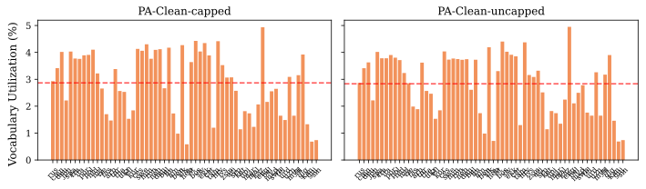

### Parity-aware vs plain BPE

*Targeted metrics (shown first): Gini ↓, Vocab-util CoV ↓, Multiling. sent/tok ↑.*

*Safety gates that differ here: Byte-frag (benign), Long toks (>64), Junk toks (≥8) ↓.*

| Tokenizer | Gini ↓ | Vocab-util CoV ↓ | Multiling. sent/tok ↑ | Vocab size | Eng comp (B/tok) ↑ | Vocab util ↑ | CER ↓ | Boundary-cross ↓ | Operator-isol ↑ | Byte-frag (benign) | Long toks (>64) | Junk toks (≥8) ↓ |
|---|---|---|---|---|---|---|---|---|---|---|---|---|
| PA-Clean-capped | **0.081** | **0.4138** | **0.0232** | 127,835 | 4.238 | 0.605 | 0.00043 | **0.02198** | **0.987** | 5596 | 8 | **28** |
| BPE-Clean-capped | 0.114 | 0.4913 | 0.0228 | 128,000 | 4.428 | **0.615** | 0.00043 | 0.02860 | **0.987** | 2642 | 0 | 46 |
| BPE-Clean-uncapped | 0.375 | 0.6167 | 0.0140 | 128,004 | **4.559** | 0.535 | 0.00043 | 0.02832 | 0.986 | 1325 | 17 | 135 |

*Faceted per-language vocabulary utilization, one pane per tokenizer (panes labeled by raw key):*

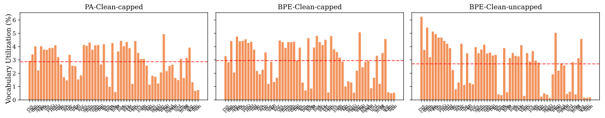

### Hybrid-window vs base parity

*Targeted metrics (shown first): Eng comp (B/tok) ↑, Multiling. sent/tok ↑, Gini ↓, Vocab-util CoV ↓.*

*Safety gates that differ here: Byte-frag (benign), Long toks (>64), Junk toks (≥8) ↓.*

| Tokenizer | Eng comp (B/tok) ↑ | Multiling. sent/tok ↑ | Gini ↓ | Vocab-util CoV ↓ | Vocab size | Vocab util ↑ | CER ↓ | Boundary-cross ↓ | Operator-isol ↑ | Byte-frag (benign) | Long toks (>64) | Junk toks (≥8) ↓ |
|---|---|---|---|---|---|---|---|---|---|---|---|---|
| PA-Clean-capped | **4.238** | **0.0232** | **0.081** | **0.4138** | 127,835 | **0.605** | 0.00043 | **0.02198** | **0.987** | 5596 | 8 | 28 |
| PA-Clean-capped-base | 3.133 | 0.0214 | 0.087 | 0.4258 | 127,835 | 0.527 | 0.00043 | 0.02238 | 0.986 | 5188 | 3 | **14** |

*Faceted per-language compression (sentences/token), one pane per tokenizer (panes labeled by raw key):*

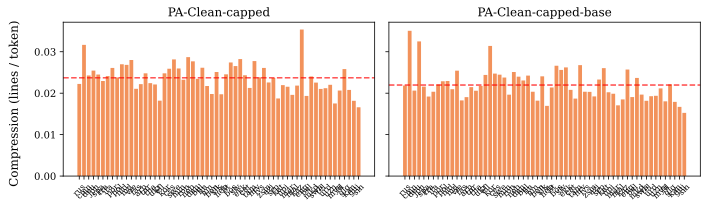

### PA-BPE training-data config (gpt4: balanced vs FineWeb2-full)

*Targeted metrics (shown first): Multiling. sent/tok ↑, Gini ↓, Vocab-util CoV ↓.*

*Safety gates that differ here: Byte-frag (benign), Long toks (>64), Junk toks (≥8) ↓.*

Confound-free single-family data-regime comparison: gpt4 pretok, hybrid-window, uncapped throughout — only the training corpus changes (balanced vs FineWeb2-full). The further **FineWeb2-full → tuned** refinements (European ratio up-weighting, two quality removals, semitic regroup) are isolated for apertus in the EU-weighting and semitic-regroup ablations below. Note: punctuation/whitespace *capping* is a pretokenization-regex choice with its own ablation, **not** a data-config change.

| Tokenizer | Multiling. sent/tok ↑ | Gini ↓ | Vocab-util CoV ↓ | Vocab size | Eng comp (B/tok) ↑ | Vocab util ↑ | CER ↓ | Boundary-cross ↓ | Operator-isol ↑ | Byte-frag (benign) | Long toks (>64) | Junk toks (≥8) ↓ |
|---|---|---|---|---|---|---|---|---|---|---|---|---|
| PA-gpt4-balanced | 0.0138 | 0.415 | 0.4619 | 127,826 | **4.610** | **0.689** | 0.00043 | **0.01205** | 0.472 | 2837 | 4 | 59 |
| PA-gpt4-fineweb2full | **0.0235** | **0.076** | **0.3755** | 127,825 | 4.433 | 0.590 | 0.00043 | 0.02226 | **0.505** | 5673 | 8 | **33** |

*Faceted per-language compression (sentences/token), one pane per tokenizer (panes labeled by raw key):*

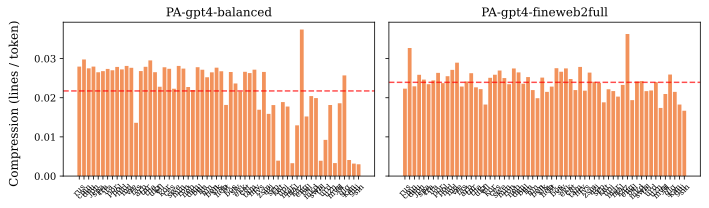

### Pretokenizer family (apertus vs clean-multi vs gpt4)

*Targeted metrics (shown first): Operator-isol ↑, Eng comp (B/tok) ↑, Multiling. sent/tok ↑.*

*Safety gates that differ here: Byte-frag (benign), Junk toks (≥8) ↓.*

| Tokenizer | Operator-isol ↑ | Eng comp (B/tok) ↑ | Multiling. sent/tok ↑ | Vocab size | Vocab util ↑ | Vocab-util CoV ↓ | Gini ↓ | CER ↓ | Boundary-cross ↓ | Byte-frag (benign) | Junk toks (≥8) ↓ |
|---|---|---|---|---|---|---|---|---|---|---|---|
| PA-Apertus-capped | 0.502 | 4.336 | 0.0233 | 127,835 | **0.606** | 0.4130 | 0.081 | 0.00043 | 0.02208 | 5592 | **27** |
| PA-Clean-capped | **0.987** | 4.238 | 0.0232 | 127,835 | 0.605 | 0.4138 | 0.081 | 0.00043 | **0.02198** | 5596 | 28 |
| PA-gpt4-fineweb2full | 0.505 | **4.433** | **0.0235** | 127,825 | 0.590 | **0.3755** | **0.076** | 0.00043 | 0.02226 | 5673 | 33 |

*Faceted per-language compression (sentences/token), one pane per tokenizer (panes labeled by raw key):*

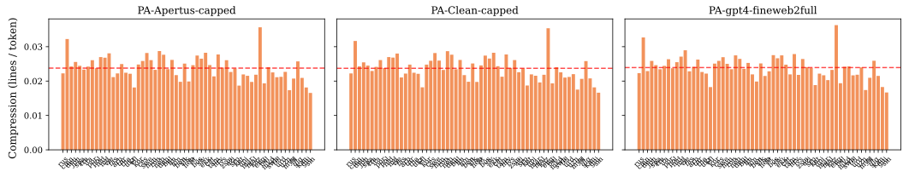

### SuperBPE base, transition point & stage-2 preset

*Targeted metrics (shown first): Eng comp (B/tok) ↑, Multiling. sent/tok ↑, Vocab util ↑.*

*Safety gates that differ here: Lossless ↑, Byte-frag (benign), Long toks (>64), Junk toks (≥8) ↓.*

| Tokenizer | Eng comp (B/tok) ↑ | Multiling. sent/tok ↑ | Vocab util ↑ | Vocab size | Vocab-util CoV ↓ | Gini ↓ | CER ↓ | Boundary-cross ↓ | Operator-isol ↑ | Lossless ↑ | Byte-frag (benign) | Long toks (>64) | Junk toks (≥8) ↓ |
|---|---|---|---|---|---|---|---|---|---|---|---|---|---|
| SuperBPE(PA-base)·gpt4o·t90k | 5.620 | 0.0137 | **0.662** | 128,000 | **0.4906** | 0.428 | 0.00043 | 0.01127 | 0.509 | 0.9867 | 2445 | 4 | **50** |
| SuperBPE(PA-base)·gpt4o·t64k | 5.869 | **0.0143** | 0.602 | 128,000 | 0.5094 | 0.400 | 0.00043 | 0.01336 | 0.493 | 0.9867 | 2103 | 6 | 72 |
| SuperBPE(PA-base)·clean-c2·t90k | 5.148 | 0.0141 | 0.652 | 128,000 | 0.5124 | 0.397 | 0.00043 | 0.01087 | **0.987** | 0.9867 | 2359 | 5 | 63 |
| SuperBPE(PA-base)·clean-c3·t90k | 5.598 | 0.0136 | 0.651 | 128,000 | 0.4978 | 0.429 | 0.00043 | **0.01030** | 0.627 | 0.9867 | 2357 | 5 | 55 |
| SuperBPE(plain-base)·gpt4o·noNFC | **6.159** | 0.0139 | 0.484 | 128,000 | 0.6230 | **0.387** | **0.00000** | 0.02663 | 0.452 | 1.0000 | 1156 | 6 | 92 |

*Faceted per-language compression (sentences/token), one pane per tokenizer (panes labeled by raw key):*

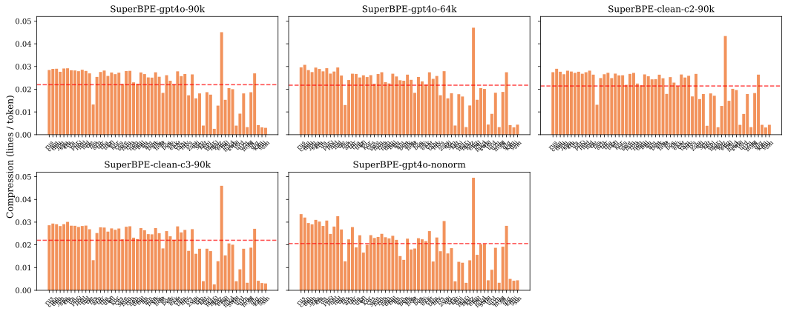

### Algorithm / pretok (plain BPE vs Unigram, right-align digits, gpt2-style)

*Targeted metrics (shown first): Operator-isol ↑, Eng comp (B/tok) ↑, Multiling. sent/tok ↑, Gini ↓.*

*Safety gates that differ here: Byte-frag (benign), Junk toks (≥8) ↓.*

| Tokenizer | Operator-isol ↑ | Eng comp (B/tok) ↑ | Multiling. sent/tok ↑ | Gini ↓ | Vocab size | Vocab util ↑ | Vocab-util CoV ↓ | CER ↓ | Boundary-cross ↓ | Byte-frag (benign) | Junk toks (≥8) ↓ |
|---|---|---|---|---|---|---|---|---|---|---|---|
| BPE-gpt2 | **0.987** | 4.761 | 0.0134 | 0.389 | 128,256 | 0.507 | 0.5843 | 0.00000 | **0.02119** | 1249 | 117 |
| BPE-rightalign | 0.478 | **4.796** | **0.0137** | 0.384 | 128,256 | 0.500 | 0.5809 | 0.00000 | 0.02668 | 1290 | **116** |
| Unigram-gpt4o | 0.887 | 3.093 | 0.0130 | **0.306** | 128,256 | **0.583** | **0.5201** | 0.00000 | 0.08215 | 9932 | 304 |

*Faceted per-language compression (sentences/token), one pane per tokenizer (panes labeled by raw key):*

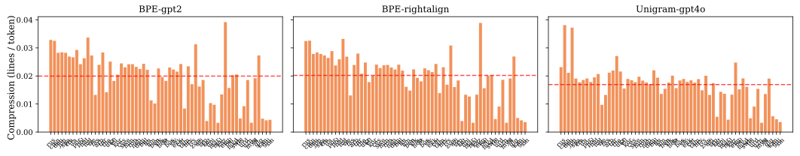

### Parity tuning — European-family up-weighting (original ×1.0 → ×1.1 → ×1.2)

*Targeted metrics (shown first): Eng comp (B/tok) ↑, Multiling. sent/tok ↑, Gini ↓, Vocab-util CoV ↓.*

*Safety gates that differ here: Byte-frag (benign).*

×1.0 is the **original/untuned** config; ×1.1 and ×1.2 are the tuned config (European ratio up-weighting + two quality removals + semitic regroup) at two up-weighting strengths. So **original → ×1.1 bundles all the tuning changes**, while **×1.1 → ×1.2 isolates the European up-weighting strength**. The trainer picks the language with the *minimum* `compression_rate / ratio`, so a higher EU ratio ⇒ more merges for English/European ⇒ denser English encoding.

| Tokenizer | Eng comp (B/tok) ↑ | Multiling. sent/tok ↑ | Gini ↓ | Vocab-util CoV ↓ | Vocab size | Vocab util ↑ | CER ↓ | Boundary-cross ↓ | Operator-isol ↑ | Byte-frag (benign) |
|---|---|---|---|---|---|---|---|---|---|---|
| PA-Apertus-capped (original, EU×1.0) | 4.335 | 0.0233 | **0.075** | **0.3860** | 127,835 | 0.592 | 0.00043 | **0.02202** | **0.505** | 5679 |
| PA-Apertus-capped (EU×1.1) | 4.335 | 0.0233 | 0.077 | 0.3976 | 127,835 | 0.601 | 0.00043 | 0.02205 | 0.499 | 5645 |
| PA-Apertus-capped | **4.336** | 0.0233 | 0.081 | 0.4130 | 127,835 | **0.606** | 0.00043 | 0.02208 | 0.502 | 5592 |

*Faceted per-language compression (sentences/token), one pane per tokenizer (panes labeled by raw key):*

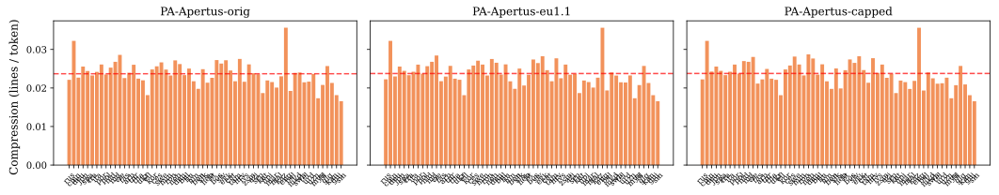

### Tuned config — semitic regroup of script-mismatched languages (with vs without)

*Targeted metrics (shown first): Gini ↓, Vocab-util CoV ↓, Multiling. sent/tok ↑, Boundary-cross ↓.*

*Safety gates that differ here: Byte-frag (benign).*

Isolates one tuned fix at ×1.2: regrouping script-mismatched languages (`ydd_Hebr` Hebrew-script; `kas/knc/uzs_Arab` Arabic-script) into the *semitic* group so they share script-appropriate merges. Effects should concentrate in those scripts' per-language fairness / boundary-crossing, not the global averages.

| Tokenizer | Gini ↓ | Vocab-util CoV ↓ | Multiling. sent/tok ↑ | Boundary-cross ↓ | Vocab size | Eng comp (B/tok) ↑ | Vocab util ↑ | CER ↓ | Operator-isol ↑ | Byte-frag (benign) |
|---|---|---|---|---|---|---|---|---|---|---|
| PA-Apertus-capped | 0.081 | 0.4130 | 0.0233 | 0.02208 | 127,835 | 4.336 | **0.606** | 0.00043 | **0.502** | 5592 |
| PA-Apertus-capped (tuned, no regroup) | 0.081 | **0.4109** | 0.0233 | 0.02208 | 127,835 | 4.336 | 0.605 | 0.00043 | 0.498 | 5601 |

*Faceted per-language vocabulary utilization, one pane per tokenizer (panes labeled by raw key):*

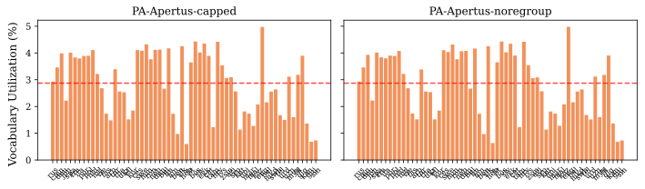

### SuperBPE on the PA-BPE candidate base (does SuperBPE help, matched data)

*Targeted metrics (shown first): Eng comp (B/tok) ↑, Multiling. sent/tok ↑, Gini ↓.*

*Safety gates that differ here: Byte-frag (benign), Long toks (>64), Junk toks (≥8) ↓.*

| Tokenizer | Eng comp (B/tok) ↑ | Multiling. sent/tok ↑ | Gini ↓ | Vocab size | Vocab util ↑ | Vocab-util CoV ↓ | CER ↓ | Boundary-cross ↓ | Operator-isol ↑ | Byte-frag (benign) | Long toks (>64) | Junk toks (≥8) ↓ |
|---|---|---|---|---|---|---|---|---|---|---|---|---|
| PA-Apertus-capped | 4.336 | **0.0233** | **0.081** | 127,835 | **0.606** | **0.4130** | 0.00043 | 0.02208 | 0.502 | 5592 | 8 | **27** |
| SuperBPE·apertus-cap·hw·fw2full | **5.402** | 0.0230 | 0.110 | 128,000 | 0.544 | 0.4992 | 0.00043 | 0.02686 | 0.466 | 3441 | 1 | 76 |
| PA-Clean-capped | 4.238 | 0.0232 | **0.081** | 127,835 | 0.605 | 0.4138 | 0.00043 | **0.02198** | **0.987** | 5596 | 8 | 28 |
| SuperBPE·clean-cap·hw·fw2full | 5.013 | 0.0227 | 0.106 | 128,000 | 0.550 | 0.4892 | 0.00043 | 0.02629 | **0.987** | 3435 | 0 | 77 |

*Faceted per-language compression (sentences/token), one pane per tokenizer (panes labeled by raw key):*

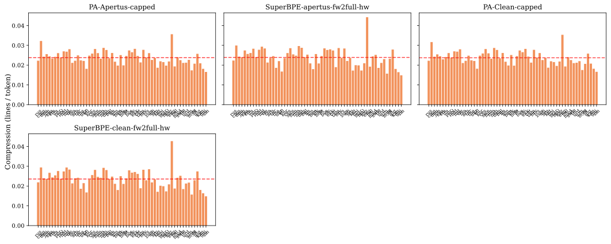

### SuperBPE training data (balanced vs FineWeb2-full)

*Targeted metrics (shown first): Multiling. sent/tok ↑, Gini ↓, Eng comp (B/tok) ↑.*

*Safety gates that differ here: Byte-frag (benign), Long toks (>64), Junk toks (≥8) ↓.*

| Tokenizer | Multiling. sent/tok ↑ | Gini ↓ | Eng comp (B/tok) ↑ | Vocab size | Vocab util ↑ | Vocab-util CoV ↓ | CER ↓ | Boundary-cross ↓ | Operator-isol ↑ | Byte-frag (benign) | Long toks (>64) | Junk toks (≥8) ↓ |
|---|---|---|---|---|---|---|---|---|---|---|---|---|
| SuperBPE(PA-base)·gpt4o·t90k | 0.0137 | 0.428 | **5.620** | 128,000 | **0.662** | 0.4906 | 0.00043 | **0.01127** | **0.509** | 2445 | 4 | **50** |
| SuperBPE·gpt4·base·fw2full | 0.0223 | **0.092** | 5.071 | 128,000 | 0.522 | **0.4411** | 0.00043 | 0.02378 | 0.506 | 4522 | 11 | 70 |
| SuperBPE·gpt4·hw·fw2full | **0.0232** | 0.109 | 5.560 | 128,000 | 0.537 | 0.4821 | 0.00043 | 0.02712 | 0.467 | 3444 | 19 | 104 |

*Faceted per-language compression (sentences/token), one pane per tokenizer (panes labeled by raw key):*

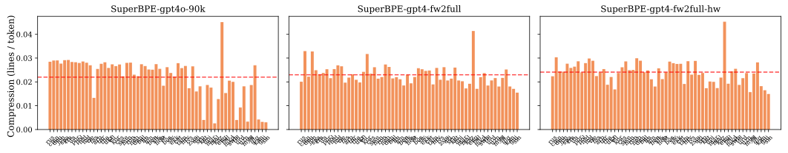

### Hybrid-window vs base parity, under SuperBPE

*Targeted metrics (shown first): Eng comp (B/tok) ↑, Multiling. sent/tok ↑, Gini ↓, Vocab-util CoV ↓.*

*Safety gates that differ here: Byte-frag (benign), Long toks (>64), Junk toks (≥8) ↓.*

| Tokenizer | Eng comp (B/tok) ↑ | Multiling. sent/tok ↑ | Gini ↓ | Vocab-util CoV ↓ | Vocab size | Vocab util ↑ | CER ↓ | Boundary-cross ↓ | Operator-isol ↑ | Byte-frag (benign) | Long toks (>64) | Junk toks (≥8) ↓ |
|---|---|---|---|---|---|---|---|---|---|---|---|---|
| SuperBPE·apertus-cap·base·fw2full | 5.011 | 0.0225 | 0.100 | 0.4591 | 128,000 | **0.551** | 0.00043 | 0.02476 | 0.494 | 4126 | 1 | 60 |
| SuperBPE·apertus-cap·hw·fw2full | 5.402 | 0.0230 | 0.110 | 0.4992 | 128,000 | 0.544 | 0.00043 | 0.02686 | 0.466 | 3441 | 1 | 76 |
| SuperBPE·clean-cap·base·fw2full | 4.693 | 0.0220 | 0.100 | 0.4613 | 128,000 | 0.543 | 0.00043 | 0.02473 | 0.985 | 4217 | 1 | **53** |
| SuperBPE·clean-cap·hw·fw2full | 5.013 | 0.0227 | 0.106 | 0.4892 | 128,000 | 0.550 | 0.00043 | 0.02629 | **0.987** | 3435 | 0 | 77 |
| SuperBPE·gpt4·base·fw2full | 5.071 | 0.0223 | **0.092** | **0.4411** | 128,000 | 0.522 | 0.00043 | **0.02378** | 0.506 | 4522 | 11 | 70 |
| SuperBPE·gpt4·hw·fw2full | **5.560** | **0.0232** | 0.109 | 0.4821 | 128,000 | 0.537 | 0.00043 | 0.02712 | 0.467 | 3444 | 19 | 104 |

*Faceted per-language compression (sentences/token), one pane per tokenizer (panes labeled by raw key):*

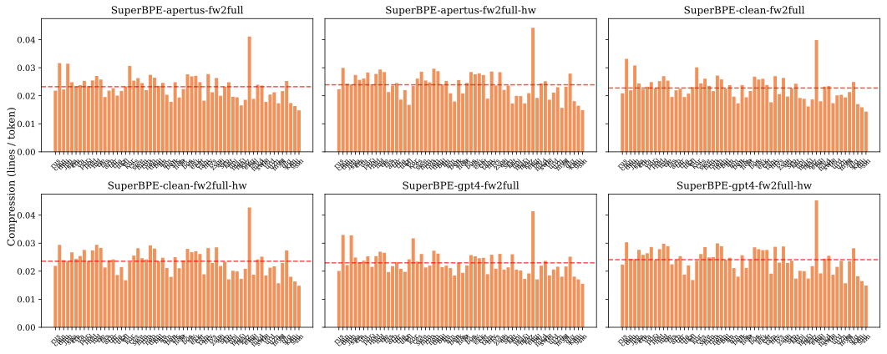

## 4. Per-language plots — compression & vocabulary utilization (small multiples, one panel per language)

**flores60** — compression & vocabulary utilization:

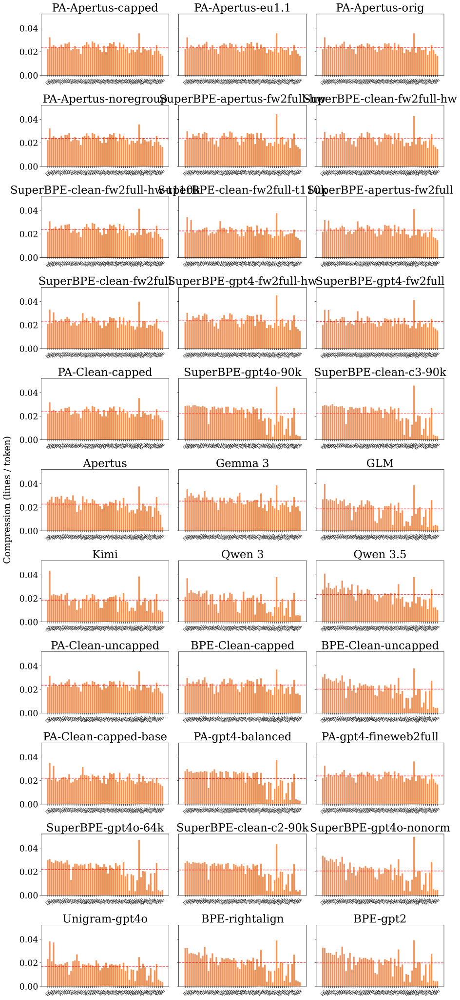

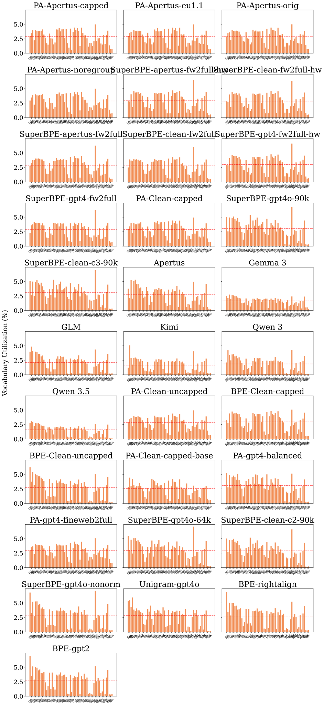

**core** — compression & vocabulary utilization:

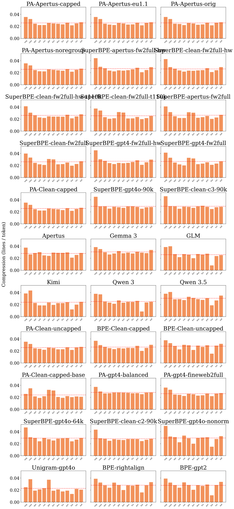

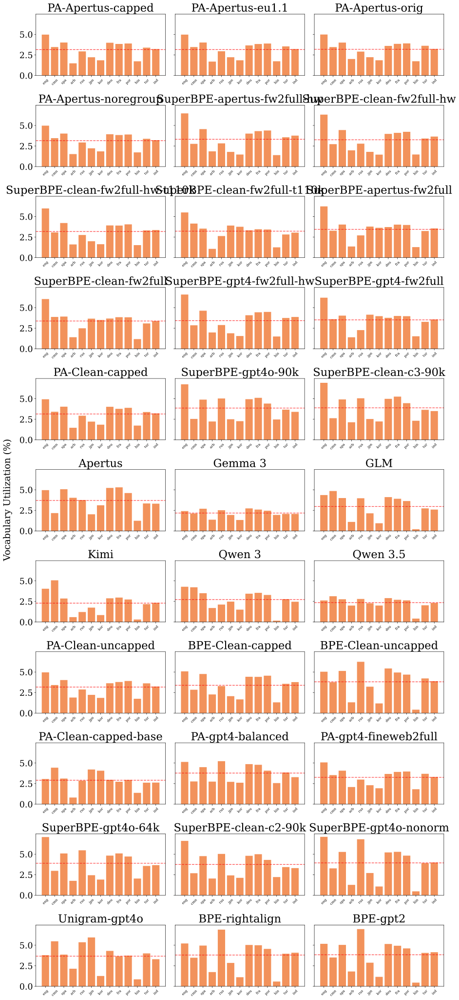

## 5. Extrinsic metrics — downstream LM evaluation

The sections above are *intrinsic* (computed from the tokenizer alone). This section reports *extrinsic* results: small language models trained from scratch on each tokenizer and then evaluated, so the differences reflect impact on actual LM quality. Imported from the companion `tokenizer-lm` project (`/users/cmeister747/tokenizer-lm/paper/tables/pairwise-compact.tex`).

**Setup (from tokenizer-lm):**
- **Models:** nanochat-based transformers; every comparison is made *within a single vocabulary size*, so transformer-matrix parameters and the token budget match across the pair. Token budget = 10.5 × (transformer matrices + lm_head). Note that this is the Kaplan version of the Chinchilla rule that was ablated by the nanochat library. It includes embedding params, unlike the 20x rule. Ends up being similar in practice; µP for learning-rate transfer; fixed batch sizes; matrix LR 0.02 (chosen by a 5-point sweep).
- **Data mixture** (shared by tokenizer and LM training): 35% FineWeb-Edu (English), 30% filtered FineWeb2 (30 languages, top-33% quality), 15% FineMath-4+, 15% StarCoderData (top tier).
- **Metrics:** **BPB** (bits-per-byte; tokenizer-independent) on the validation set and FLORES-200, plus downstream **BLiMP** (grammar, 67 subtasks) and **Code** (HumanEval / MBPP). Lower BPB is better.

**Controlled pairwise comparisons.** Δ = B − A for each metric. The Val / FLORES (tr.) / FLORES (all) columns are Wilcoxon signed-rank tests over the per-language BPB vectors (Val and FLORES (tr.) = 31 trained languages; FLORES (all) ≈ 214 FLORES+ languages), BH-FDR adjusted within each test family. **Bold** = p_adj < 0.05. For the BPB columns a **negative Δ means B is better**.

> **Caveat:** the factors below are tokenizer-lm's own controlled ablation axes; they do not map one-to-one onto the tokenizer names in the intrinsic tables above, and these LMs are trained on the tokenizer-lm data mixture rather than the intrinsic-eval corpora.

#### NFC normalization

*Intrinsic analog: §3 SuperBPE *noNFC* variant and the *Lossless* production-safety gate.*

| A | B | ΔVal | ΔFLORES (tr.) | ΔFLORES (all) | ΔBLiMP | ΔCode |
|---|---|---|---|---|---|---|
| GPT-4o | + NFC | +0.0004 | -0.0033 | -0.0017 | +0.0320 | +0.0003 |
| Claude | + NFC | **-0.0012** | -0.0045 | **-0.0052** | -0.0080 | -0.0006 |
| RightAlign | + NFC | **-0.0007** | **-0.0061** | **-0.0056** | -0.0031 | -0.0002 |

#### Algorithm

*Intrinsic analog: §3 *Algorithm / pretok (plain BPE vs Unigram, …)*.*

| A | B | ΔVal | ΔFLORES (tr.) | ΔFLORES (all) | ΔBLiMP | ΔCode |
|---|---|---|---|---|---|---|
| BPE GPT-4o | Unigram | **+0.0331** | **+0.0329** | **+0.0472** | +0.0545 | +0.0355 |
| BPE Claude | Unigram | **+0.0304** | **+0.0308** | **+0.0408** | -0.0037 | +0.0355 |
| BPE RightAlign | Unigram | **+0.0300** | **+0.0312** | **+0.0452** | +0.0336 | +0.0343 |

#### Unigram tuning

| A | B | ΔVal | ΔFLORES (tr.) | ΔFLORES (all) | ΔBLiMP | ΔCode |
|---|---|---|---|---|---|---|
| Untuned | Tuned | +0.0018 | **+0.0019** | **+0.0061** | -0.0846 | +0.0027 |

#### Pretokenizer

*Intrinsic analog: §3 *Pretokenizer family* and *Algorithm / pretok*.*

| A | B | ΔVal | ΔFLORES (tr.) | ΔFLORES (all) | ΔBLiMP | ΔCode |
|---|---|---|---|---|---|---|
| GPT-4o | Claude | **+0.0019** | +0.0001 | **+0.0035** | +0.0245 | +0.0001 |
| GPT-4o | Punct | **+0.0074** | +0.0038 | **+0.0087** | +0.0179 | +0.0089 |
| GPT-4o | RightAlign | **+0.0021** | **+0.0028** | **+0.0052** | +0.0176 | +0.0012 |
| GPT-4o | Whitespace | +0.0094 | **+0.0072** | **-0.0116** | +0.0066 | +0.0086 |
| GPT-4o | GPT-2 | +0.0014 | +0.0001 | +0.0018 | +0.0167 | -0.0029 |

#### Training data

*Intrinsic analog: §3 *PA-BPE training-data config (balanced vs FineWeb2-full)*.*

| A | B | ΔVal | ΔFLORES (tr.) | ΔFLORES (all) | ΔBLiMP | ΔCode |
|---|---|---|---|---|---|---|
| Balanced | English | **+0.0511** | **+0.0333** | **+0.0082** | +0.0124 | +0.0401 |
| Balanced | Code | **+0.0363** | **+0.0188** | **-0.0133** | +0.0259 | +0.0248 |
| Claude bal | Claude eng | **+0.0475** | **+0.0281** | +0.0003 | -0.0141 | +0.0270 |
| Punct bal | Punct eng | **+0.0419** | **+0.0208** | **-0.0096** | +0.0190 | +0.0310 |
| Balanced | High-res | +0.0013 | **+0.0250** | **-0.0153** | +0.0212 | +0.0034 |
| Balanced | High-mid | +0.0023 | **+0.0164** | **+0.0044** | +0.0119 | +0.0031 |

#### PA-BPE family

*Intrinsic analog: §3 *Pretokenizer family (apertus vs clean-multi vs gpt4)*.*

| A | B | ΔVal | ΔFLORES (tr.) | ΔFLORES (all) | ΔBLiMP | ΔCode |
|---|---|---|---|---|---|---|
| GPT-4 pretok | clean pretok | -0.0020 | **-0.0079** | **-0.0089** | +0.0073 | -0.0060 |
| Base | Hybrid-window | -0.0061 | **-0.0090** | **-0.0062** | +0.0441 | -0.0095 |

#### Trainer (BPE vs PA-BPE)

*Intrinsic analog: §3 *Parity-aware vs plain BPE*.*

| A | B | ΔVal | ΔFLORES (tr.) | ΔFLORES (all) | ΔBLiMP | ΔCode |
|---|---|---|---|---|---|---|
| BPE clean | PA-BPE clean | +0.0076 | -- | -- | -- | -- |

#### SuperBPE

*Intrinsic analog: §3 the three SuperBPE ablations (on-base, training data, hybrid-window vs base).*

| A | B | ΔVal | ΔFLORES (tr.) | ΔFLORES (all) | ΔBLiMP | ΔCode |
|---|---|---|---|---|---|---|
| GPT-4o BPE | + SuperBPE | +0.0122 | **+0.0157** | **+0.0063** | +0.0045 | +0.0066 |
| PA-BPE bal | + SuperBPE | +0.0037 | -0.0049 | **-0.0093** | +0.0032 | -0.0059 |
| t90k | t64k | +0.0001 | -0.0005 | -0.0004 | +0.0036 | +0.0022 |
| C2 (bal) | C3 (bal) | +0.0011 | **+0.0042** | **-0.0064** | -0.0186 | +0.0047 |

## Appendix — long-token (>64 char) examples

Examples truncated to 40 chars; entries that look blank are long runs of spaces. These flag decorative-junk tokens (e.g. `----`, `====`, space runs) vs legitimate long multibyte-script words.

- **PA-Apertus-capped** (8): `ဝႃးသျိၼ်းဢၼ်ၽိမ်းဢွၵ်ႇလႆႈ`, `ၵၢၼ်ႁဵတ်းသၢင်ႈယၢမ်းလဵဝ်`, ` ဢၼ်လွတ်ႈလႅဝ်းထၢင်ႇႁၢင်ႈ`, `ဢဝ်ၼႃႈလိၵ်ႈသၢင်ႇထုၵ်ႇဝႃႈ`, `ລາຍການກະຈາຍສຽງຂອງວີໂອເອ`, `လွင်ႈလႅၵ်ႈလၢႆႈမႂ်ႇမႂ်ႇ`
- **PA-Clean-capped** (8): `ဝႃးသျိၼ်းဢၼ်ၽိမ်းဢွၵ်ႇလႆႈ`, `ိူဝ်းသျိၼ်းဢၼ်ဢိတ်ႇဢွၵ်ႇလႆႈ`, `လွင်ႈလႅၵ်ႈလၢႆႈမႂ်ႇမႂ်ႇ`, `ລາຍການກະຈາຍສຽງຂອງວີໂອເອ`, `ဢဝ်ၼႃႈလိၵ်ႈသၢင်ႇထုၵ်ႇဝႃႈ`, `ၵၢၼ်ႁဵတ်းသၢင်ႈယၢမ်းလဵဝ်`
- **SuperBPE·apertus-cap·hw·fw2full** (1): `home/iot/openthread/cmake-build-debug/CM`
- **Apertus** (8): `----------------------------------------`, `****************************************`, `                                        `, `                                        `, ` ***************************************`, `----------------------------------------`
- **GLM** (119): `----------------------------------------`, `/***************************************`, `#---------------------------------------`, ` =======================================`, `########################################`, ` ---------------------------------------`
- **Kimi** (90): `//--------------------------------------`, `                                        `, ` =======================================`, `----------------------------------------`, `########################################`, `----------------------------------------`
- **Qwen 3** (116): ` ***************************************`, ` =======================================`, `########################################`, `****************************************`, `                                        `, ` /*-------------------------------------`
- **Qwen 3.5** (80): ` ***************************************`, `//**************************************`, `////////////////////////////////////////`, `                                        `, `                                        `, ` /**************************************`
- **BPE-Clean-uncapped** (17): ` #--------------------------------------`, `########################################`, ` =======================================`, ` ---------------------------------------`, `────────────────────────────────`, `****************************************`
- **PA-Apertus-capped (EU×1.1)** (8): `ဝိူဝ်းသျိၼ်းဢၼ်ဢိတ်ႇဢွၵ်ႇလႆႈ`, `ၵၢၼ်ႁဵတ်းသၢင်ႈယၢမ်းလဵဝ်`, `ိူဝ်းသျိၼ်းဢၼ်ဢိတ်ႇဢွၵ်ႇလႆႈ`, ` ဢၼ်လွတ်ႈလႅဝ်းထၢင်ႇႁၢင်ႈ`, `လွင်ႈလႅၵ်ႈလၢႆႈမႂ်ႇမႂ်ႇ`, `ဝႃးသျိၼ်းဢၼ်ၽိမ်းဢွၵ်ႇလႆႈ`
- **PA-Apertus-capped (tuned, no regroup)** (8): `ၵၢၼ်ႁဵတ်းသၢင်ႈယၢမ်းလဵဝ်`, `ລາຍການກະຈາຍສຽງຂອງວີໂອເອ`, `ိူဝ်းသျိၼ်းဢၼ်ဢိတ်ႇဢွၵ်ႇလႆႈ`, `ဢဝ်ၼႃႈလိၵ်ႈသၢင်ႇထုၵ်ႇဝႃႈ`, `လွင်ႈလႅၵ်ႈလၢႆႈမႂ်ႇမႂ်ႇ`, `ဝိူဝ်းသျိၼ်းဢၼ်ဢိတ်ႇဢွၵ်ႇလႆႈ`
- **PA-Apertus-capped (original, EU×1.0)** (8): `ၵၢၼ်ႁဵတ်းသၢင်ႈယၢမ်းလဵဝ်`, `ိူဝ်းသျိၼ်းဢၼ်ဢိတ်ႇဢွၵ်ႇလႆႈ`, `ລາຍການກະຈາຍສຽງຂອງວີໂອເອ`, ` ဢၼ်လွတ်ႈလႅဝ်းထၢင်ႇႁၢင်ႈ`, `ဝိူဝ်းသျိၼ်းဢၼ်ဢိတ်ႇဢွၵ်ႇလႆႈ`, `ဝႃးသျိၼ်းဢၼ်ၽိမ်းဢွၵ်ႇလႆႈ`
- **PA-Clean-capped-base** (3): `လွင်ႈလႅၵ်ႈလၢႆႈမႂ်ႇမႂ်ႇ`, `ၵၢၼ်ႁဵတ်းသၢင်ႈယၢမ်းလဵဝ်`, `ဢဝ်ၼႃႈလိၵ်ႈသၢင်ႇထုၵ်ႇဝႃႈ`
- **PA-Clean-uncapped** (14): `ဢဝ်ၼႃႈလိၵ်ႈသၢင်ႇထုၵ်ႇဝႃႈ`, `ဝႃးသျိၼ်းဢၼ်ၽိမ်းဢွၵ်ႇလႆႈ`, `----------------------------------------`, `****************************************`, `ဝိူဝ်းသျိၼ်းဢၼ်ဢိတ်ႇဢွၵ်ႇလႆႈ`, `                                        `
- **PA-gpt4-balanced** (4): `########################################`, `สัตว์เลี้ยงลูกด้วยน้ำนม`, `#---------------------------------------`, ` =======================================`
- **PA-gpt4-fineweb2full** (8): `ၵၢၼ်ႁဵတ်းသၢင်ႈယၢမ်းလဵဝ်`, `ဢဝ်ၼႃႈလိၵ်ႈသၢင်ႇထုၵ်ႇဝႃႈ`, `ဝိူဝ်းသျိၼ်းဢၼ်ဢိတ်ႇဢွၵ်ႇလႆႈ`, `လွင်ႈလႅၵ်ႈလၢႆႈမႂ်ႇမႂ်ႇ`, `ိူဝ်းသျိၼ်းဢၼ်ဢိတ်ႇဢွၵ်ႇလႆႈ`, ` ဢၼ်လွတ်ႈလႅဝ်းထၢင်ႇႁၢင်ႈ`
- **SuperBPE·apertus-cap·base·fw2full** (1): `လွင်ႈလႅၵ်ႈလၢႆႈမႂ်ႇမႂ်ႇ`
- **SuperBPE(PA-base)·clean-c2·t90k** (5): ` ---------------------------------------`, `----------------------------------------`, `########################################`, ` ---------------------------------------`, ` =======================================`
- **SuperBPE(PA-base)·clean-c3·t90k** (5): ` ---------------------------------------`, `########################################`, `----------------------------------------`, ` =======================================`, ` ---------------------------------------`
- **SuperBPE·clean-cap·base·fw2full** (1): `လွင်ႈလႅၵ်ႈလၢႆႈမႂ်ႇမႂ်ႇ`
- **SuperBPE·gpt4·base·fw2full** (11): `****************************************`, ` ---------------------------------------`, `----------------------------------------`, `****************************************`, `လွင်ႈလႅၵ်ႈလၢႆႈမႂ်ႇမႂ်ႇ`, `----------------------------------------`
- **SuperBPE·gpt4·hw·fw2full** (19): `----------------------------------------`, `########################################`, `                                        `, ` =======================================`, `****************************************`, `----------------------------------------`
- **SuperBPE(PA-base)·gpt4o·t64k** (6): ` ---------------------------------------`, `----------------------------------------`, `########################################`, `########################################`, ` ---------------------------------------`, ` =======================================`
- **SuperBPE(PA-base)·gpt4o·t90k** (4): `สัตว์เลี้ยงลูกด้วยน้ำนม`, ` ---------------------------------------`, ` =======================================`, ` ---------------------------------------`
- **SuperBPE(plain-base)·gpt4o·noNFC** (6): `########################################`, `########################################`, ` =======================================`, `****************************************`, ` =======================================`, `########################################`

### Junk-token (≥8 punctuation/symbol/whitespace run) examples

Tokens that are runs of ≥8 punctuation/symbol/whitespace chars with no letters or digits (the *Junk toks* gate — decorative separators / whitespace runs). Truncated to 40 chars.

- **PA-Apertus-capped** (27): `................`, `================`, `***************`, `****************`, `;;;;;;;;`, `________`
- **PA-Clean-capped** (28): `============`, `////////`, `________________`, `........`, `##############`, `////////////////`
- **SuperBPE·apertus-cap·hw·fw2full** (76): `//--------------`, `-----------`, `************`, `--------------`, `#---------------`, `::::::::`
- **SuperBPE·clean-cap·hw·fw2full** (77): `::::::::`, `----------`, `||||||||`, `================`, `%%%%%%%%%%%%%%%%`, `**********`
- **Apertus** (46): `================`, `'../../../`, `##############`, `-----------------`, `^{[}^{]}`, `----------------------------------------`
- **Gemma 3** (150): `##########`, `############`, `++++++++++++++++`, `---------------`, `========`, `*********/`
- **GLM** (334): `========================================`, `----------
`, `'../../../../`, `+-+-+-+-`, `........................................`, `===============`
- **Kimi** (273): `****************************************`, `========================================`, `/***************************************`, `****************************************`, `****************************************`, `******/
`
- **Qwen 3** (337): `//--------------------------------------`, `("../../`, `'./../../`, `---------
`, `________________________________`, `...");

`
- **Qwen 3.5** (245): `----------------------------------------`, `:-------------</`, `-----------`, `========================================`, `----------------------------------------`, `=============`
- **BPE-Clean-capped** (46): `////////`, `------------`, `==============`, `++++++++`, `----------------`, `................`
- **BPE-Clean-uncapped** (135): `----------------------------------------`, `########################################`, `_________________`, `-------------`, `________________`, `;;;;;;;;`
- **BPE-gpt2** (117): `++++++++++++++++`, `...............`, `*********************************`, `////////////////////////////////`, `________________________________________`, `--------------------------------`
- **BPE-rightalign** (116): `************`, `_________________

`, `-------
`, `-------
`, `---------`, `--------`
- **PA-Apertus-capped (EU×1.1)** (27): `%%%%%%%%`, `============`, `---------------`, `********`, `************`, `----------------`
- **PA-Apertus-capped (tuned, no regroup)** (27): `========`, `----------------`, `////////`, `;;;;;;;;`, `************`, `________`
- **PA-Apertus-capped (original, EU×1.0)** (27): `////////////////`, `================`, `********`, `~~~~~~~~`, `----------------`, `***************`
- **PA-Clean-capped-base** (14): `/***************`, `********`, `************`, `________`, `----------------`, `****************`
- **PA-Clean-uncapped** (64): `;;;;;;;;;;;;;;;;;;;;;;;;;;;;;;;;`, `****************************************`, `--------------------------------`, `================================`, `-----------`, `########################################`
- **PA-gpt4-balanced** (59): `--------`, `----------
`, `-------
`, `********************************`, `##############`, `****************`
- **PA-gpt4-fineweb2full** (33): `================================`, `________________________________`, `========================================`, `****************`, `****************************************`, `%%%%%%%%%%%%%%%%`
- **SuperBPE·apertus-cap·base·fw2full** (60): `**************`, `''''''''`, `||||||||`, `;;;;;;;;`, `---------`, `----------------`
- **SuperBPE(PA-base)·clean-c2·t90k** (63): `----------------------------------------`, `'../../../`, `########################################`, `****************************************`, `----------`, `================`
- **SuperBPE(PA-base)·clean-c3·t90k** (55): `////////////////////////////////`, `~~~~~~~~~~~~~~~~`, `========================================`, `----------------------------------------`, `.........`, `'../../../`
- **SuperBPE·clean-cap·base·fw2full** (53): `==============`, `----------------`, `//--------------`, `////////////////`, `:-------------`, `../../../`
- **SuperBPE·gpt4·base·fw2full** (70): `****************************************`, `________________`, `----------------------------------------`, `-------------`, `................................`, `----------------------------------------`
- **SuperBPE·gpt4·hw·fw2full** (104): `;;;;;;;;;;;;;;;;`, `########################################`, `%%%%%%%%%%%%%%%%%%%%%%%%%%%%%%%%%%%%%%%%`, `****************`, `========`, `********************************`
- **SuperBPE(PA-base)·gpt4o·t64k** (72): `////////////////`, `____________`, `****************************************`, `============`, `****************`, `########################################`
- **SuperBPE(PA-base)·gpt4o·t90k** (50): `................................`, `********************************`, `########################################`, `~~~~~~~~~~~~~~~~`, `---------------------------------`, `........`
- **SuperBPE(plain-base)·gpt4o·noNFC** (92): `########################################`, `________________________________________`, `. . . . `, `########################################`, `==========`, `================================`
- **Unigram-gpt4o** (304): `\;\;\;\;\;\;\;`, `===============`, `******/
/`, `//
//
//
//
//
/`, `==========`, `||-||-||`

### Dead / unreachable vocabulary examples (tokens the normalizer can never emit)

- **Gemma 3** (5): ` ::::::::`, ` diffformul`, ` yyyy`, ` `, ` YYYY`
- **Qwen 3** (248): `藍`, `סּ`, ` và`, `樂`, `יִ`, `य़`, `來`, `תּ`
